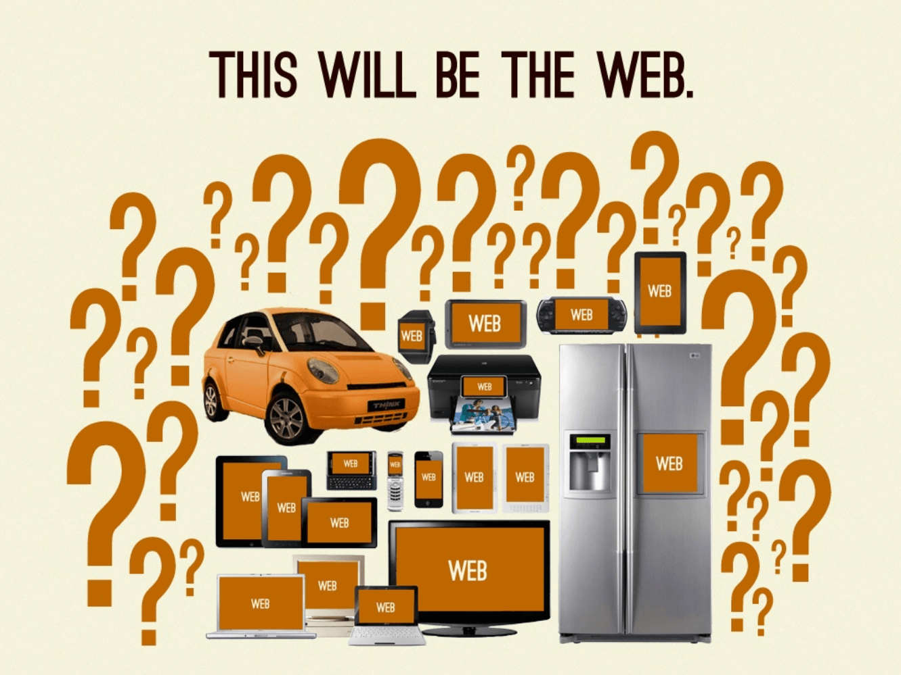
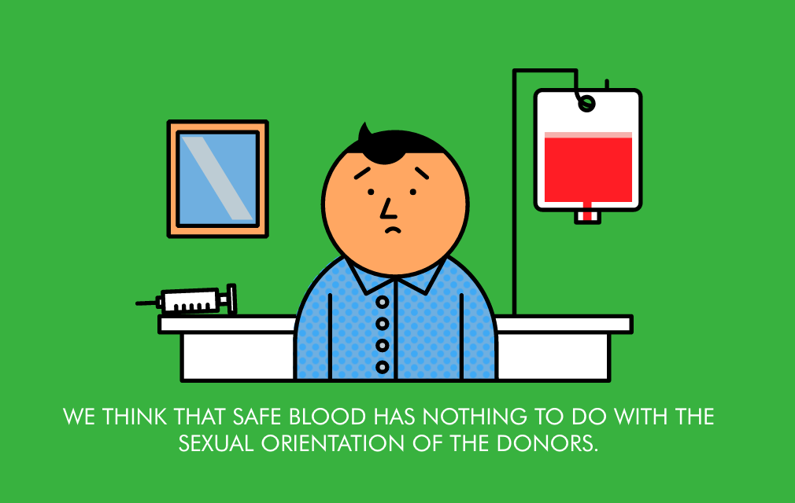

# Week 1

### Today, Wednesday 6th January 2016

1. [Welcome](#welcome) :)
* Workshop: [HTML & CSS recap](#workshop) 
* Project: [**Sharing is caring**](#project)

### Your [homework](#homework) and [blog](#blog)!


# Welcome



1. [What is this course about?](../../README.md)
* [What will you do?](../../README.md#projects)
* [What can you learn?](../../README.md#learning-goals)
* [What's the plan?](../../README.md#plan)   
* [Rules of the road](../../README.md#rules-of-the-road).
* Keeping a **journal** to record your creative process is *extremely* important. Don't let your ideas and thoughts fade away! Think of your project blog as your **digital sketchbook**. More on that [here](https://github.com/RavensbourneWebMedia/Blogging#why-blogging).

	A few observations:
	
	* Blog **regularly** as in week by week, not all in one lump. Capture your ideas whilst they're fresh!
	* Write for yourself, not to please me.
	* When you reference an external resource (something you've seen, read or learned about somewhere else on the Web) always link to it
	* Write in an active voice, eg “*This project allowed me to pick a recipe of my choice and code it using HTML and CSS*” instead of “*I had to code a recipe*” or even worse “*The recipe was coded…*”
	* Use a spell-checker.
	* Read your writings out loud. It'll help you spot mistakes and make your written thoughts flow.
	* simple ≠ simplistic (which means oversimplified and has a negative connotation)
	* complex ≠ complicated (which means it could be simplified, and has a negative connotation) 


# Workshop

We're going to refresh our working knowledge of HTML, CSS and GitHub, and learn a few new **CSS tricks** that can come useful for your [*Sharing is caring*](#project) brief.

Specifically, we'll learn how to:

* Get images to fill up the whole browser's window, without loosing their original aspect ratio (`background-size: cover`)
* Position elements in the horizontal and vertical centre of the page (using the `position: absolute, top: 50%, left: 50% and negative margin` trick)
* Create *curtain reveal* effect with CSS only (`background-attachment: fixed`)
* Use Git to publish your page on [GitHub Pages](https://pages.github.com), the free hosting service from GitHub

Here's [all the code for the finished thing](../../resources/css-curtain).

### Step by step

We start by building our page in **HTML**, and then we'll make it _stylish_ with CSS.

1. Let's create an HTML document and add the basic building blocks: `html`, `head` and `body` tags.
* In the `head` we can add a `title`.
* We're going to divide our page into sections, so let's create a few empty `section` tags.
* In the first section we'll add an image, which could serve as a logo  
  
	```html
	<div class="logo">
		
	</div>
	```
* We'll have two sections with textual content, so let's write something in there.  
  
	Copy-paste something appropriate from the Web (using `right-click` > `Inspect Element` and then copying the HTML code for the part(s) you want to use in your page).
	
	<!--Alternatively, go to http://chooseyouripsum.com and pick your favourite dummy text.-->
* Then we're going to add a Mailchimp signup form at the end of the page.   
  
  You can either use the embed code below (quicker), or head over to [mailchimp.com](http://mailchimp.com), sign up and make a *list* (it will take you longer, but you'll then be in control of that list).
  
  ```html
	<div id="mc_embed_signup">
	<form action="//twitter.us12.list-manage.com/subscribe/post?u=43efbdeecd252c30b1ead06d0&amp;id=ab4c4ec792" method="post" id="mc-embedded-subscribe-form" name="mc-embedded-subscribe-form" class="validate" target="_blank" novalidate>
	 	<div id="mc_embed_signup_scroll">
			<div class="mc-field-group">
				<label for="mce-EMAIL">Email Address </label>
				<input type="email" value="" name="EMAIL" class="required email" id="mce-EMAIL">
			</div>
			<div id="mce-responses" class="clear">
				<div class="response" id="mce-error-response" style="display:none"></div>
				<div class="response" id="mce-success-response" style="display:none"></div>
			</div> 
	    	<div style="position: absolute; left: -5000px;" aria-hidden="true">
	    	<input type="text" name="b_43efbdeecd252c30b1ead06d0_ab4c4ec792" tabindex="-1" value="">
	    </div>
	    <div class="clear">
	    	<input type="submit" value="Subscribe" name="subscribe" id="mc-embedded-subscribe" class="button">
	    </div>
	  </div>
	</form>
	</div>
	```
* Get the embed code.
* Copy-paste it into your last section. We can enhance the form with a catchy title, a _call-to-action_ and a placeholder for the input field.

Now the fun part: **CSS**.

1. We want to tell the browser not to mess with our style.   
  
	So we're going to use a little CSS utility called [**normalize.css**](https://necolas.github.io/normalize.css/), which resets the default browser's stylesheet and provides a consistent common ground to base our own styles. 
	
	Let's include a `link` in the `head`, which will point to `normalize.css` copy in the `css/` folder.  
  
	```html
	<link rel="stylesheet" href="css/normalize.css">
	```
* As you can see, `normalize.css` has flattened our page. Now we can start building our own style. 

	Let's create a new `link` in our `head` and point it to a new CSS file called **style.css**.

	```html
	<link rel="stylesheet" href="css/style.css">
	```
* We are going start with **typography**. 
	
	We can grab a **font** from [Google Fonts](https://www.google.com/fonts): pick a typeface you like and then grab the `link` code for it and paste it in your page's head. 

	Where? Between `normalize.css` and  `style.css`

	```html
	<link href='https://fonts.googleapis.com/css?family=Source+Code+Pro:400,300,700,900' rel='stylesheet' type='text/css'>
	```
	
	Let's give some ground rules to our page, by applying them to the `body` element. Then we can set the rules for  headings, paragraphs and bold elements.
* To make the content sections **centred in the page**, we add `class="content"` to all the `section` elements that contain text. 

	```css
	.content 
	{
		margin: 2em auto;
		max-width: 40em;
		padding: 0 1em;
	}
	```
	
	This will make for a much more comfortable reading experience.
* Let's work on the **full-size images**.   
  
	First we want to get some `section` elements in our page to take the full browser height. So we create a `.full` class and give it a `height: 100%;` property

	This is not enough though. 

	It is important to understand what `height: 100%;`means: _the full height of the parent element_. It doesn't magically mean *the height of the window*. So if you want your main container to have the height of the window, setting `height: 100%;` isn’t enough.

	_Why?_ Because the parent of your `section` (`body`) has its height set by default to `auto`, which means it is sized according to its _content_. Then, you can try adding `height: 100%;` to the `body` element to see… it is still not enough.

	_Why?_ Because the parent of `body` (`html`) has also its height set by default to `auto`. Now what if you try to add `height: 100%;` to the `html` element? It works!
 
 	We can check that it works by applying a `background-color: yellow;` (or whatever) to our first `.full`
* Next we're styling the **logo**.

	By default images will be added to the top-left corner of their *parent*.
	
	If we want it to be centred, we need CSS. 
	
	Let's give the `img` a class `logo`.
	
	To get the image out of the standard HTML flow, we give it a `position: absolute;`

	Then we offset it by 50% from the top, and 50% from the left. But it’s still not centred.. cause what we’ve centred is the _registration point_ of the image, ie its top-left corner.

	So to get the image properly centred, we need to shift up and left by half its size. We do that by using the **negative margin trick**: by giving our element a negative margin, we're effectively moving it in the direction we want. As the image is 320px square, half of it is 160px, so `_margin-top: -169px; margin-left: -160px;`
	
	```css
	.logo 
	{
		position: absolute;
		top: 50%;
		left: 50%;
		width: 320px;
		height: 320px;
		margin-left: -160px;
		margin-top: -160px;
	}
	```
	
	We also need to make sure that the `img` is not bigger than its container
	
	```css
	.logo img 
	{
		width: 100%;
	}
	```
* Now onto the **images**. We're going to use `background-image` to define a few images that will be applied to the background of our `.full` elements. 

	In our stylesheet, we create a bunch of `id` selectors and give them different `background-image` values, eg: 
	
	```css
	#one 
	{ 
		background-image: url("../images/one.jpg"); 
	}
	```

	When referencing the image location, we need to keep in mind that the starting point is the CSS file itself, so from there we have to navigate one folder up (`../`) and then go to `images/{imageFile}.jpg`

	By default background-images *tile*, but we want them to take up the whole available screen space, without losing their aspect ratio (no squashing). 

	We can achieve that with `background-size`. This property can take various values: pixel sizes, percentages, and then a couple of interesting keywords. 

	* `contain` will scale the image so as to be as large as possible providing that it is **contained** within the background positioning area. 
	* `cover` instead, will scale the image, this time to be as large as possible so that the background positioning area is completely **covered** by the background image.

	We're going to add `background-size: cover;` to the `.full` rule (so that it will apply to all sections with the `full` class).
 
 Let's add all the other images.
* Now we want to get the **curtain reveal effect**, so that instead of scrolling with the rest of the page, the background-images will be revealed as we scroll up and down. That makes our page more interesting.

	We can achieve this with another CSS property, `background-attachment`. With this property we have two options: 
	
	* `scroll` (default): the background image will scroll with the rest of the content.
	* `fixed`: the background image will remain stationary as the rest of the content is scrolled

	Which one do we want? Obviously `fixed`.
	
	Add `background-attachment: fixed;` to `.full`
* Good! The last bit is to give a bit of style to the Mailchimp **form**.

	We are going to use the **negative margin trick** to centre the form.
	
	```css
	position:absolute; 
	top:50%; 
	left:50%;
	```
	
	If we add `position:absolute; top:50%; left:50%;` etc the form will jump up to the top of the page. Why is that?

	We define an element in `absolute` mode because we want it to be in the middle of its parent... and instead, it's in the middle of the window. Wtf? 

	Actually, this is the intended behaviour (not by you, but definitely by the browser). The keyword here is **context**.
	
	The above code basically tells the browser _“I want my element top to be positioned 50% top and 50% left according to its **context**”_. 
	
	So what is the context? **It is the first non-static ancestor**. 

	It can be the direct parent. Or the parent of the parent. Or the parent of the parent of the parent. As long as it is not `static`.

	At the moment, the `form` parent (or actually, grandparent if we consider `#mc_embed_signup`) is `.full`, which has the default `position: static` value. 

	So we'll go ahead and change that to `position: relative`. 
	
	```css
	.full 
	{
		height: 100%;
		background-color: yellow;
		background-size: cover;
		background-attachment: fixed;
		position: relative;
	}
	```


# Project

### Sharing is caring

This project is about using code (HTML, CSS and a dash of JavaScript) creatively to communicate and advocate a cause you care about.

All the project material is [here](../../projects/sharing-is-caring).

[](../../projects/sharing-is-caring)

# Homework

### CSS trick video tutorial 

Make a screencast (video screen capture with audio narration) about the CSS trick you learned before Xmas.

Start from blank HTML + CSS files and demonstrate all steps. 

Post your video to **YouTube** and push the code for your tutorial to **GitHub**.

##### Tricks 

Who | Which trick
--- | -----------
Kaleshe<br>Malore<br>Tom | How to use `color` and `background-color` to enhance the behaviour of elements in different states: `hover`, `focus`, `active` and `visited`. 
Will<br>Melissa<br>Joe | How to style elements to look and feel like *clickable things* (usually referred to as *buttons*), including but not limited to CSS properties like `border` and `border-radius`.
Francisco<br>Akvile<br>Ajay | How to use `relative` and `absolute` `position`ing to control elements precisely (to the pixel).
Dean<br>Rajeev<br>Jennifer | How to centre elements horizontally, including but not limited to CSS properties like `display` and `margin: auto`.
Ben<br>Rosie<br>Shajee | How to use CSS `transition`s.
Darren<br>Josh | How to use the CSS animation library  [Animate.css](https://daneden.github.io/animate.css).  
Mark<br>Afsara | How to use vector icons from [Font Awesome](https://fortawesome.github.io/Font-Awesome). 

<!-- Ikran<br>Shajee | How to use `position: fixed;` to make elements stick to the page (not scroll away). -->

### Blog

Jot down 2-3 ideas for [*Sharing is caring*](#project).

Start researching your cause and write about how you could *angle* it.

Sketches and storyboards very welcome.