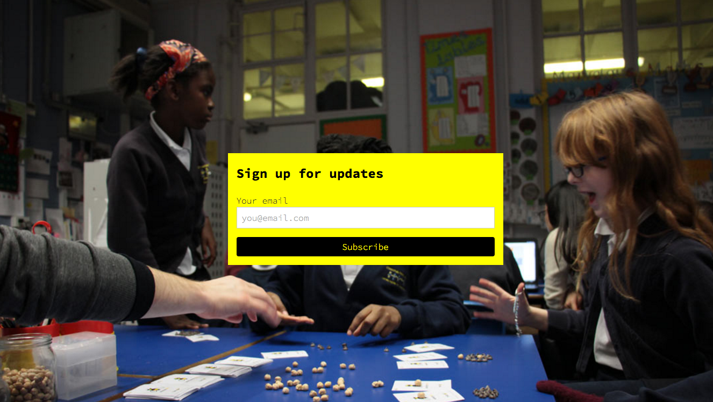
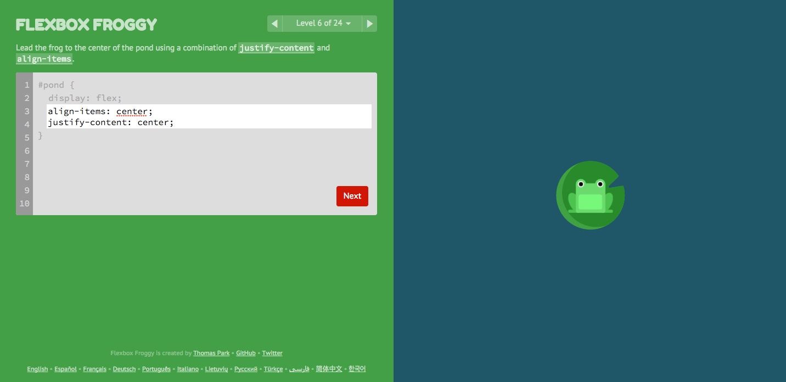
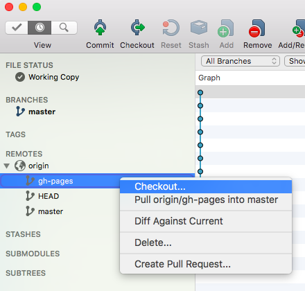

# Week 2

### Today, Wednesday 13th January 2016

1. Video tutorials peer-review
* Workshop: [HTML, CSS & GitHub recap](#workshop) 
* Tutorials on [*Sharing is caring*](#project)

<!--

* BONUS: Principles of programming
* Workshop: scroll magic (NEXT WEEK) 
 
-->

### Your [homework](#homework) and [blog](#blog)!


# Peer-review

1. Add your video's links to the Google doc (link on Slack).
* Let's chat about how you made it and what you learned.  


# Workshop

We're going to refresh our working knowledge of HTML, CSS and GitHub, and learn a few new **CSS tricks** that can come useful for your [*Sharing is caring*](#project) brief.

Last week we've learned how to:

* Get images to fill up the whole browser's window, without loosing their original aspect ratio (`background-size: cover`)
* Position elements in the horizontal and vertical centre of the page (using the `position: absolute, top: 50%, left: 50% and negative margin` trick)
* Create *curtain reveal* effect with CSS only (`background-attachment: fixed`)

Here's [all the code for the finished thing](../../resources/css-curtain).

[](../../resources/css-curtain)

This week we'll:

- [ ] Demo how the signup form is centred 
- [ ] Check out the peer-learning video to explain `position: relative` and `position: absolute` (also see [demos below](#position))  
- [ ] Introduce `flexbox`, a new powerful **layout system for CSS**, which makes possible (and almost easy) some of the things that so far were hacky and complicated 

	* [Quick intro on LearnLayout](http://learnlayout.com/flexbox.html)
	* [Guide on CSS tricks](https://css-tricks.com/snippets/css/a-guide-to-flexbox/) 
	* [FlexboxFroggy](http://flexboxfroggy.com), a game to learn `flexbox`
	
		[](http://flexboxfroggy.com)

- [ ] Use Git to publish your page on [GitHub Pages](https://pages.github.com), the free hosting service from GitHub.

### Publishing on GitHub pages

<!-- Follow [the instructions](https://pages.github.com/) for `Project site` > `Start from scratch` -->

1. If you already have a **repository** for your project, skip to the next step. 

	Otherwise... create a **new repository**.   
  
	Make sure you `Initialize this repository with a README`.
* In your repository's main page, create a **new branch** and call it `gh-pages` (call it exactly like that: no uppercase and no spaces).	
	
* Make `gh-pages` the **default branch**.

	
* Use [SourceTree](https://www.sourcetreeapp.com/) to **clone your repository** to your computer.  
  
	*Cloning* means downloading a working copy of the repository on your computer. You'll then be able to make work on the repository on your computer and *push* your work to GitHub.
  
  	On a Mac: <kbd>cmd</kbd> + <kbd>n</kbd>
  
  	On a PC: <kbd>ctrl</kbd> + <kbd>n</kbd>
  
	`Clone from URL` and paste in your repository's URL (eg: `https://github.com/YOUR-GITHUB-USERNAME/YOUR-REPOSITORY-NAME`) 	
* Make sure that your *working copy* (the version of your repository on your computer) is on the `gh-pages` branch.	
	In the image below, notice that the local branch is `master` (in bold under `BRANCHES`). If that's the case for your repository, then right-click on `gh-pages` under `REMOTES` and then choose `Checkout...`. This will switch your working copy to the `gh-pages` branch.
	
	
* If you haven't already, **move all the files** for your page (HTML, CSS, images... everything that makes up your page) into the repository's folder.
* Using SourceTree, **commit and push** all those files.

	Notice that as soon as you commit, a red `1` appears on top of the `Push` button. In order to upload those files to GitHub you need to *push* all your commits (push that button).
* After you pushed to the `gh-pages` branch your page will be automatically updated by GitHub.   
  
	To **view your page**, go to `https://YOUR-GITHUB-USERNAME.github.io/YOUR-REPOSITORY-NAME` (notice it's github.**io** instead of .com).
	
	That's it, now your page is published, you can celebrate (and share the link on Slack)! :tada: 

### Making sense of CSS `position` and `float`

> Laying out content using CSS is easy. You chop your page up and shove the chunks wherever you please...

To become a skilled *CSS bricklayer*, there are only two properties that you *should really learn*

* `position` (see the [docs on WebPlatform](https://docs.webplatform.org/wiki/css/properties/position))
* `float` (see the [docs on WebPlatform](https://docs.webplatform.org/wiki/css/properties/float))

#### Position

* `static` is the default value. 

	Static elements just sit in the normal HTML flow.

	
	
* `relative` is similar to `static` but the element can be offset from its original position with the properties `top`, `right`, `bottom` and `left`.

	
 
* `absolute` pulls an element out of the normal HTML flow and other elements will behave as if it's not even there. 

	> The offset values for `top`, `right`, `bottom` and `left` of an absolutely-positioned element will be *relative* to its first *non-static ancestor*. :scream:
	
	For example, `left: 10px` will offset an absolute element 10 px from the left edge of its first ancestor which is not static (it can be the direct parent, or the parent of the parent, or the parent of the parent of the parent... as long as it is the first which is not static).

	Note that without a `width` set, the element will stretch only as wide as the content it contains.

	You can set, for instance, both a `left` and `right` value and the element will stretch to touch both points. So you can fill a screen by setting 
	
	```css
	top: 0; 
	left: 0; 
	bottom: 0; 
	right: 0;
	```

	

* `fixed` behaves like `absolute`, but it will position an element in relation to the browser window.
 
 	Fixed elements stay where they are on the screen even when the page is scrolled.

 	

The animated gifs above are from [this article on Froont](images from http://blog.froont.com/positioning-in-web-design).
 	
Play around with `position` using this [interactive example on CodePen](http://codepen.io/baddeo/pen/OPxJLP)

The most powerful use of `position` is [**absolute *inside* relative**](http://css-tricks.com/absolute-positioning-inside-relative-positioning/). Double OMG :scream::scream:

#### Float

Floating an element will allow surrounding content to flow around it.

Using `float` you can 

* `float: left` 
* `float: right`
* `float: none` (default)

Then, if you do not want the next element to wrap around the floating objects, you can apply the `clear` property

* `clear: left` will clear left floated elements
* `clear: right` will clear right floated elements
* `clear: both` will clear both left and right floated elements

Floating is commonly used to create layouts with columns.

Play around with `float` using this [interactive example on CodePen](http://codepen.io/baddeo/pen/ZYXEXo)

Learn more about `float` on [CSS Tricks](http://css-tricks.com/almanac/properties/f/float).


# Project

### Sharing is caring

This project is about using code (HTML, CSS and a dash of JavaScript) creatively to communicate and advocate a cause you care about.

All the project material is [here](../../projects/sharing-is-caring).

Let's review your ideas and sketches in small groups. 


# Homework

### Peer-learning research: *how does it WWWork*? 

We can think of the WWW as a **Web of interlinked knowledge** in constant evolution.

To put this concept into practice, let's pretend that each one of us is a `node` in a `network` of knowledge. Each node will hold information about a certain concept related to the WWW. 

In teams, **research one key Web concept** to explain to your classmates next week. 

Keep in mind: next week we'll do this **without screen-based slides**, so don't prepare a presentation but rather be ready to discuss your topic with everyone else!

Who | What
--- | -----------
Jacob<br>Kevin | Tim Berners-Lee 
Callum<br> | HyperText
Dom<br> | HTTP
Clarenz<br> | DNS
Emma<br> | IP address
Ricardo<br> | Browser
Mayur<br> | Server
Peyman<br> | Internet submarine cables  
Muhammed<br> | Net neutrality

Put your team's **research notes** in a Google document (next week you'll have to blog about it).
 	
In your research notes, make sure you **reference your sources** of information. That is, don't just copy-paste from Wikipedia. Instead, include a link to the Wikipedia article where your text comes from.

### Blog 

Complete the tutorial [JavaScript for cats](http://jsforcats.com/), and blog about it! :scream_cat:

[](http://jsforcats.com/)
