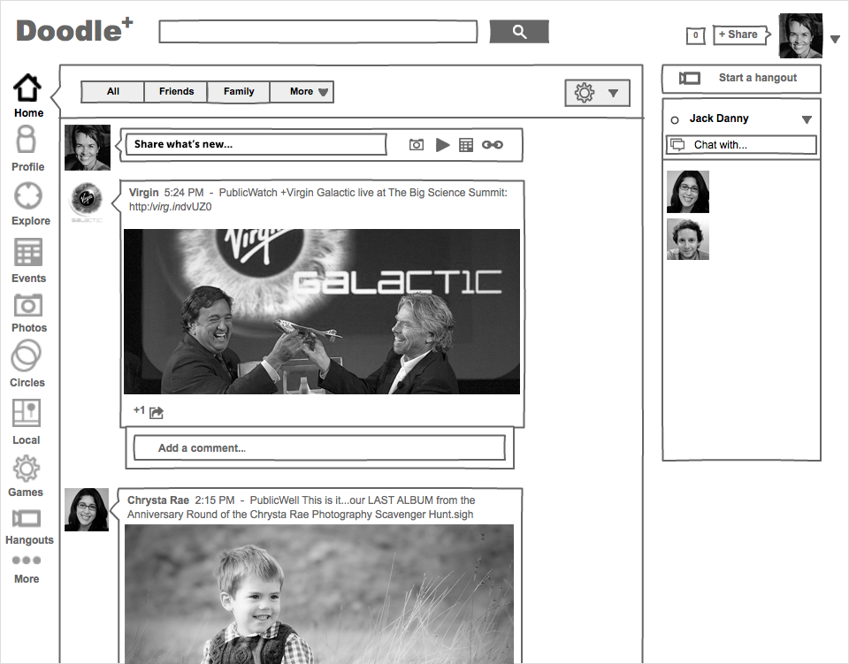
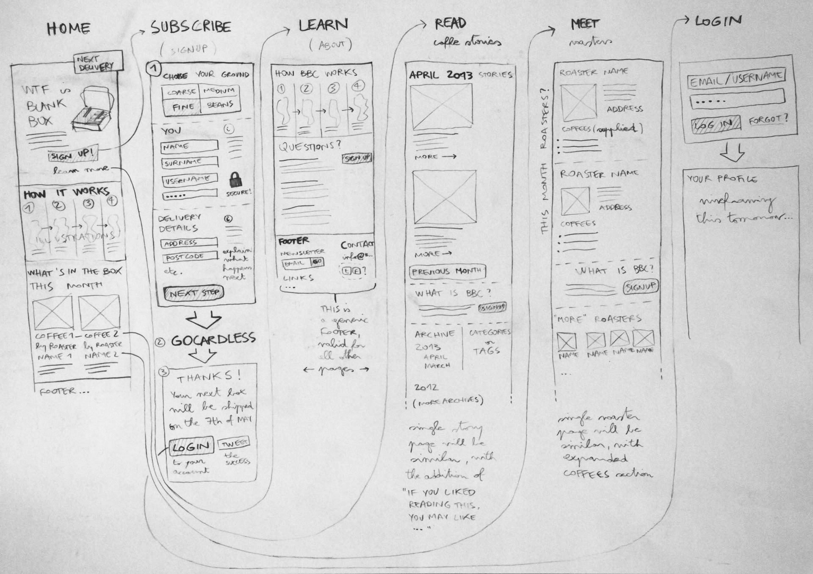
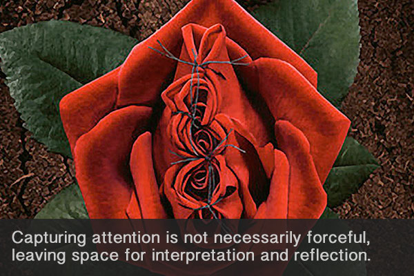

<!--

- [x] Print wireframing templates
- [x] which section from Infoadvocacy?
- [x] post-its 

-->

# Week 4

### Today, Wednesday 27th January 2016

1. [*How does it WWWork* quiz](#quiz-time)
* [Workshop](#workshop): wireframe your one-pager
* [Wireframes critique](#critique) 

Your [homework](#homework) and [blog](#blog)!


# Quiz time!

### How does it WWWork?

1. The latest version of HTML is `HTML6` 

	- [ ] true 
	- [ ] false
* EVERY HTML **element** has an opening **tag** (eg: `<a href="http://example.com">`) and a closing **tag** (eg: `</a>`)

	```html
	<a href="http://example.com"> Click me! </a>   
	```
	
	- [ ] true 
	- [ ] false
* All **attributes** for an HTML elements MUST go both in the opening and closing tags
	
	```html
	<a href="http://example.com"> Click me! </a id="no-spaces-in-between"> 
	```
	
	- [ ] true 
	- [ ] false
*  In an HTML document every `id` **attribute** MUST be unique
	
	```html
    <p id="main-content">...</p>
    <div id="main-content">...</div>
    ```
	
	- [ ] true 
	- [ ] false
* An HTML **element** can have more than one `class`
	
	```html
	<p class="highlight question">...</p>
	```
	
	- [ ] true 
	- [ ] false
* A valid HTML document MUST have a `head` and a `body` elements wrapped in a `html` element
	
	- [ ] true 
	- [ ] false
* Where is best to put styling instructions? 

	- [ ] `<link rel="stylesheet" href="path/to/your-style.css">`
	- [ ] `<p style="color:red;">This bloody text</p>`
* Every CSS file has to end in `.css`
	
	- [ ] true 
	- [ ] false
* What's wrong with the following CSS line? 

	```css
   <p> { color: red; }
   ```     
* What's wrong with the following CSS line? 

	```css
  	p { colour: red; }      
	```
* What's wrong with the following CSS line? 

	```css
    p { color red; }  
   ```     
* These two CSS declarations achieve the same effect       
  
  	```css             
	p { color: red; }  
	 
	p 
	{ 
	 	color: red; 
	}
	```	
   	
	- [ ] true 
	- [ ] false     
* The `#` symbol is a shortcut for

	- [ ] `class`
	- [ ] `element`
	- [ ] `id`
* A CSS declaration must be terminated by 

	- [ ]  `.` period
	- [ ]  `!` exclamation mark
	- [ ]  `;` semi-colon
	- [ ]  `:` colon	
* `style1.css` is parsed before `style2.css` [ true / false ]
	
	```html
	<head>
    	<link href="style1.css" rel="stylesheet">
    	<link href="style2.css" rel="stylesheet">
	</head> 
	```		
	 	
	- [ ] true 
	- [ ] false 

	 
# Workshop

### Wireframes

Before they write any code, Web designers and developers **visualise** their ideas through *wireframes*.

#### Is *this* a wireframe?


#### Is *this* a wireframe?


#### Is *this* a wireframe?




#### Is *this* a wireframe?



#### Wireframes are like maps

Just like a map is an abstraction of a place that helps us describe its location and geography, **wireframes are abstractions** of the **structure** of an interactive system and the **relationships** between its components.

#### Wireframes are tools to **communicate your ideas**.

Depending on what stage your idea is at, your wireframes will be more or less detailed.

In any case, wireframes shouldn't look *finished*.

Paper wireframes get **more feedback** that digital ones, because people are less afraid to touch them, move them around, scribble notes on them. They don't look finished.

####  Wireframes are about **content**, **context** and **interaction**. 

* Use **real content**, never *lorem ipsum*. 
	
* **Words** are key. [Interface design is copywriting](https://gettingreal.37signals.com/ch09_Copywriting_is_Interface_Design.php)
	
* Think about **button labels**, how do you label user actions: is it `Share` or `Post` or `Publish` or `Say it!` or `Broadcast` for instance?  

#### Wireframes are **NOT about style**. 

When wireframing, don't worry about *colours*, *graphics* and *typography*.

### Your turn

Wireframe your one-pager idea for [Sharing is caring](../../projects/sharing-is-caring) using these paper templates from [InterfaceSketch](http://www.interfacesketch.com).


* The goal is to get your idea down on paper so that you can **present** it to everyone else later today. 

* Your wireframes will illustrate what your one-pager says (the **content**) and how people experience it (the **interactions**).

* This is to help others **visualise** your ideas and give you **feedback**. 

* The quality of your drawings and handwriting doesn't matter. No need to use rulers either. Remember, *there is no such thing as a badly drawn wireframe*. 


# Critique

1. Hang your wireframes on the wall
* Grab a pencil and some post-its 
* Let's *critique* each other's wireframes


### Critiquette

All comments must be `KASH`:

* **Kind** 
	
	Focus on the work. No sarcasm or personal comments. 
	
	Your comments can be challenging but the creator of the work should feel that your feedback is work-oriented and happy to receive it.
	
* **Actionable**	
	
	Your comments should include **suggestions** or **instructions**, which the creator of the work can simply take away and use.
	
* **Specific** 

	Don't just state `It's (not) good` or `I (don't) like it`. Explain why.
	
	Comment on specific aspects or details of the work, eg: `Your button labels are unconventional but I wonder if most people would get what they stand for..`
	
* **Helpful** 

	If it doesn't benefit the work, its creator or the class, don't share it.

In a nutshell:
 
> Be hard on content and soft on people!

<!-- From http://reflectionsofmyteaching.blogspot.co.uk/2013/04/creating-culture-of-critique.html?m=1-->

### Banned words


* *Like it* / *Don't like it*
* Clean
* Dynamic
* Empty
* Minimal(istic)
* Modern
* Poor
* Professional
* Simpl(istic)
* Static
* XYZ font
* XYZ colour / background
 

# Homework

### Sharing is caring 

Translate your wireframes into **HTML & CSS**. 

Next week we'll review them together. You don't have to present a finished page by then. Even though the final deadline for this is June the 10th, try and get as much done as possible this week, because we'll start another brief next week.

Bonus: add **animations & JS** when you're done with HTML & CSS.

### Blog

Read the chapter **Get the Idea: capturing attention** (pages 46 - 70) from [Visualising Information for Advocacy](http://visualisingadvocacy.org/getbook) (free download), which explains these techniques:

1. Juxtapose
* Subvert
* Invert
* Materialise
* Compare
* Contrast
* Illuminate
* Provoke
* Parody
* Intrigue

**Write about** how you could you use one or more of these techniques in your project.

Here are some questions to ask when developing your concept:

* What are the reasons people are not talking about or acting on your chosen issue?
* What contexts, symbols or situations can be used to represent your issue visually?
* What is the 1rst, key, singular reaction we want our audience to have? What is the second immediate reaction?
* Where will the visual be presented – in real or virtual space – and who, apart from the target audience, will see the visual?
* How can we change the context of the problem and attract new audiences?
* How can our visual open up debate,controversy or curiosity rather than reinforcing a single answer or perspective?

[](http://visualisingadvocacy.org/getbook)

<!--Summary on page 70-->

