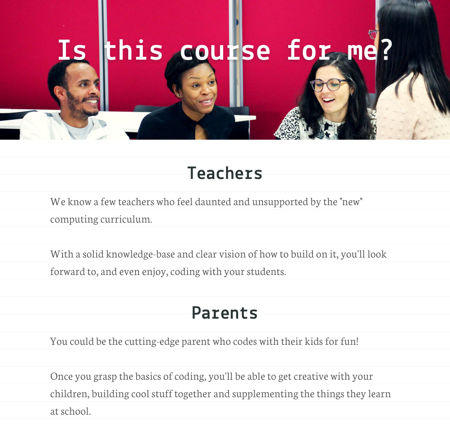

<!--
Let's take a few steps back.

- [x] Let's talk about `Lorem Ipsum` and stock images. We need a *content-first* approach.
- [] General observations (integrate suggestions in the project brief, eg: focused causes, as close to home as possible)
- [x] Keeping **text** short is good, however it needs to be also sharp. You can capture people with images but then you use text to communicate precisely what you want to get across and encourage them to take action.
- [x] Let's work on what your page will actually say, aka copywriting 
- [x] Let's make it work without JS first
--> 

# Week 7

### Today, Wednesday 17th February 2016

1. [Content first](lets-talk-about-content)
* [Workshop](#workshop): copy-writing is interface design 

Change of plan, we'll keep working on *Sharing is caring* until the Easter break.

Your [homework](#homework) and [blog](#blog)!

# Let's talk about *content*

When it comes to *content* you may hear designers (including myself) saying things like

> ... the client can do it

or 

> ... the users will *generate* it

And yet, people (the vast majority of people) come to our websites **hungry for content**.

They don't care about our *parallax scrolling*, *animated SVG*, *jQuery plugins* or whatever is trendy among us. 

They want to **find** information and **do** something with it. 

#### Usable & useful content

This is not to say that we should bin all the subtle details that can make a site delightful to use, but rather that we should start talking about the *elephant in the room*. 

## What is content then?

### Content is not *Lorem Ipsum*

`Lorem Ipsum` is gibberish that conveniently fills the available space like an expanding gas. 

It is **meaningless** and **lacks context**, revealing nothing about the relationship between your design and your content.

By using `Lorem Ipsum` you are running the risk of actual, final content breaking your carefully pixel-pushed layout. What if real title are a bit longer than the conveniently cut `Lorem Ipsum` you filled your layout with? What if your client wants to have 3 paragraphs instead of 2?

#### Using *Lorem Ipsum* is a missed opportunity to do good design.

In this course `Lorem Ipsum` is banned. I warned you.

### Stock images are the visual equivalent of *Lorem Ipsum*

Using stock images is a missed opportunity to engage with **real content**.

Instead of using a beautifully irrelevant stock image, use an ugly yet relevant one. Make it clear that it's a placeholder. 

Bad images can be useful to trigger a conversation and call for good content. As the [McDonald's theory](https://medium.com/@ienjoy/mcdonalds-theory-9216e1c9da7d) states: *people are inspired to come up with good ideas to ward off bad ones*.

### A quick experiment

1. Think about a website you visit/use regularly. 
2. Now imagine it **without text**. 
3. What would be left?

<!--

* empty boxes
* meaningless, decontextualised images

-->

### Content is mostly **text**

Text carries [95%](https://ia.net/know-how/the-web-is-all-about-typography-period) of your page's **meaning**, and gives **context** to your media (images, videos etc.)

You can capture people with (more or less moving) images but then you need text to:

* **communicate** precisely the message(s) you want to get across 
* **persuade** people to take action

# Workshop

If all we said so far holds true, then as Web designers we should adopt a **content-first** approach. Start with content, and design our sites/apps/products etc around it.

Let's work on what your page actually *says*, aka **copywriting**.

### Copywriting is interface design

As [they say](https://gettingreal.37signals.com/ch09_Copywriting_is_Interface_Design.php)

> Do you label a button *Submit* or *Save* or *Update* or *New* or *Create*? That's copywriting.

> Icons with names, form fields with examples, buttons with labels, step by step instructions in a process, a clear explanation of your refund policy. These are all interface design.

By the way, [*copywriting*](http://dictionary.reference.com/browse/copywriting) is not the same as [*copyright*](http://dictionary.reference.com/browse/copyright).

### Your turn

1. Open [this GDoc](https://docs.google.com/document/d/1iS5VeEjtzpjkFraSJ0O80NnmLQaBZIo_FNztTVoONUM/edit?usp=sharing) and `File` > `Make a copy...`
* Rename your copy by adding your first name at the beginning, eg `Billie - Content strategy`.
* Change the sharing settings for your document so that `Anyone with the link can comment`.

	
* Share the link to your document with us on Slack. 
* Write about your page **target audience(s)**, their motivations, pain points, goals and language. 
* With your audience(s) in mind, **flesh out** all the copy of your page.
* We'll **test** your first draft (read out loud) between us.
* **Edit** your draft: remove the bits that are not so important, and tweak the other bits to sound like what your audience(s) may want to read.

Here's an [example content strategy document](https://docs.google.com/document/d/1XyaSoEvu0MraH7cqeEKLMbTc1cAP-B184tB6Usx5UsM/edit?usp=sharing) I co-wrote *before* designing a [one-pager](https://codeyourapp.club) for a coding course I run. 

Taking a **content-first** approach for that project has been extremely useful, allowing us to clearly identify **who** we were writing for. With the **who** in mind, planning the content and designing the site became much easier. And it lead to a very successful recruitment drive: +285% booking!

# Homework

### Sharing is caring

Continuing with the **content-first** approach, let's make your page work without JS. 

1. Keep tweaking your page **copy** on the GDoc. Read it out loud, re-write the bits that don't flow and repeat :repeat:
* Start integrating the copy in your **HTML**.
* Style your copy with **CSS**. You can use this [checklist](http://www.merttol.com/articles/web/checklist-for-better-web-typography.html) to make your copy more readable and visually appealing.
* Add images that complement your copy. They can be *placeholders* for now. Remember, an ugly relevant image is better than a beautifully irrelevant stock picture.

### Peer-learning research 

Read the chapter **Get the idea: capturing attention** (pages 46 - 70) from [Visualising Information for Advocacy](http://visualisingadvocacy.org/getbook) (free download), which explains several techniques to capture people's attention.

Each team will **focus on one technique**. 

1. Explain how that technique works and **why**. 
* Show a few **examples** of that technique in action. Not limited to the examples from the book, you can find examples of your technique in adverts, TV, magazines, social media etc. 
* Prepare a few **questions** for the rest of the class to make your mini-lesson interactive and memorable. For instance, you can ask people if they agree/disagree with a statement, or you could ask them to guess a fact/figure before you reveal the answer...

Who | What
--- | ----
Ben & Melissa | Juxtapose
Shajee & Will | Subvert
Afsara & Malore | Invert
Josh | Materialise
Akvile & Dean | Compare
Jennifer & Tom | Contrast
Joe & Francisco | Illuminate
Rajeev & Darren | Provoke
Ajay & Mark | Parody
Rosie & Kaleshe | Intrigue

### Blog

1. Read [Copywriting is Interface Design](https://gettingreal.37signals.com/ch09_Copywriting_is_Interface_Design.php). 
* Choose a webpage (it can be one you designed / built), pick at least **5 interface elements** from that page and **analyse their copy** answering questions such as: 
	
	* Who is this interface element for?
	* When do they see this? What are they feeling at that point?
	* What do users need to know (in the context of this interface element)?
	* What must they do now, if anything? 
	* Is this interface copy effective? Why? 
	* Is it consistent with the rest of the page? Should it be? 
	* How else could it be written?
	