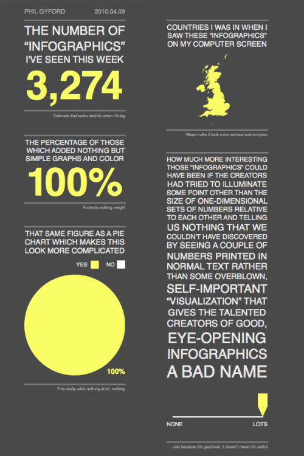

<!--
- [ ] `function makeAnimation()` for ScrollMagic? Could introduce PoP and repetition

- [ ] HTML video
	
	```html
	<div>
		<video loop="" preload="" width="100%" height="100%"> 
			<source src="video.mp4" type="video/mp4">
		</video>
		<div class="tp-dottedoverlay threexthree"></div>
	</div>
	```
-->

# Week 8

### Today, Monday 27th February 2017

1. [Peer-learning](#peer-learning): attention-grabbing techniques
* [Tutorials](#tutorials) on *Sharing is caring*

Your [homework](#homework) and [blog](#blog)!


# Peer-learning 

###  Let's learn about effective techniques to **capture people's attention**

Grabbing someone's attention is tricky, particularly when it comes to issues they may not want to hear about, or that they feel are not priority for them.

Using one or a combination of these techniques can help you draw people into your cause, and buy you those **few crucial seconds** to make a powerful *impression*. 

<!--before you can tell them about your *cause* and encourage them to take *action*.-->

Capturing your audience attention should be **your priority**. 

Think about it: if your page doesn't make your audience curious, if it doesn't provoke an initial reaction, all your hard work (your copy, your code, your message, the bulk of your project) is essentially lost on them. 

### Your turn

You have read the chapter **Get the idea: capturing attention** (pages 46 - 70) from [Visualising Information for Advocacy](http://visualisingadvocacy.org/getbook).

Each team will **focus on one technique**. 

1. Explain how that technique works and **why**. 
* Show a few **examples** of that technique in action. Not just the examples from the book. You can find examples of your technique in adverts, TV, magazines, social media etc.   
  
	Best if you show *both good and bad examples* of your technique in action.   
  
	Also, keep in mind that most examples will likely feature a combination of techniques, not just one.
* To make your mini-lesson interactive and memorable, ask **questions** to the rest of the class. For instance, you can ask people:
	* if they agree/disagree with a statement
	* guess a fact/figure before you reveal the answer
 	* how they feel about an example you are showing them
 	* whether they think the example is effective / provocative / controversial / clichéd / insulting ...

Who | What
--- | ----
Callum | **Juxtapose** <br>[def *to place side by side, especially for comparison or contrast* ] <br>Putting two or more objects/facts/events next to each other, to highlight their similarities and differences and challenge your audience perceptions.
Jacob | **Compare** <br>Similar to juxtapose but with a focus on quantifiable data. Using *size* to *measure* and *estimate* the similarities and differences between quantities. It can give a higher sense of objectivity (juxtapose can be more subjective instead).
Payman | **Subvert** the expected meaning <br> Showing something people recognise and flipping their expectations; using symbols in an unexpected context.
Afsara & Malore | **Invert** <br>Removing the subject of your communication, talking about the contrary (unexpected absence). *Whispering instead of screaming* to get someone's attention.
Emma | **Materialise** <br>Making visible what is otherwise invisible or abstract, and therefore hard to imagine and talk about.
Ricardo | **Contrast** <br>Presenting the same data in ways that make your point sharper, highlighting the *differences*.
Muhammed | **Illuminate** <br>Abstracting a complex set of data into a digestible format (eg: a transport map). Also using mundane data to hihglight a problem.
Claranz | **Provoke** <br>Asking a controversial (possibly humorous) question or making a controversial statement, in order to provoke an immediate reaction. 
Kevin | **Parody** <br>Playing with stereotypes, conventions and genres. Making people smile/laugh to make them think about something serious.
Dominic | **Intrigue** <br>Using jarring, arresting or shocking content to introduce people to a more complex issue.

### Brainstorm!

What visual / textual **hooks** can you use to lead your audience into the complexity of your cause?

How can you balance the need to be concise and *brain-catching* with the goal to help your audience go deeper?

In groups of 2-3, discuss which techniques you could use in your *Sharing is caring* projects, then brainstorm and jot down ideas in [this shared GDoc](https://docs.google.com/document/d/1iPmNnwnhaF7VxXvngHFdFizRyh0fycxVmXUprLZsXAY/edit?usp=sharing).


# Tutorials

Let's chat about your **brain-catching ideas** and **copy**.

I don't want to hear about coding issues until we have worked out your *content strategy*.

Let's not worry about how feasible / hard to build your ideas are at this point. Everything is *figureoutable*.


# Homework

### Sharing is caring

Pick one or two brain-catching ideas from today's [brainstorming session](#brainstorm) and mock them up. 

You can do that in Photoshop/Illustrator and then HTML+CSS, or directly into HTML+CSS.

Try and not get bogged down in coding issues. Instead, mock your idea up with static images and we'll help you code it next week.

Next week we'll do extensive tutorials with a guest: together we'll review your content strategy first, and then your code.

### Blog

Once we captured people's attention, **what's next**?

We can help them move from an abstract awareness to something they can grasp and relate to.

**Maps and data visualisations** (aka *infographics*) are common tools for creating visual summaries of complex issues, yet they don't often convey **engaging stories**.

[](https://www.flickr.com/photos/philgyford/4505748943 "Infographic by Phil Gyford")

From [Information is beautiful](http://www.informationisbeautiful.net/) and [Infosthetics](http://www.infosthetics.com/), pick a **good example** and a **bad example** of data visualisation and blog about how they succeed or fail to engage you with a compelling and evidence-based **narrative**.

Some questions (in no particular order) that may help you flesh out your thoughts:

* How is the data visualisation helping you (or failing to help you) **understand** the issue it presents?
* What **arguments** are your examples trying to communicate through the data?
* What **story** (if any) are your examples telling through the data?
* What **goal(s)** are your examples trying to achieve (in your opinion)?
* What data visualisation **tool** are they using (eg: map, bar chart, pie chart etc.)? Why do you think they chose that? Would you choose another tool?
* **Who** are your examples trying to **influence** (in your opinion)?
* Are the examples dumbing down the issue(s)?

<!--
communicate a clear **organising principle** for the data.

You can find 8 organising principles on the chapter **Get the picture: crafting a narrative** (pages 75 - 92) from [Visualising Information for Advocacy](http://visualisingadvocacy.org/getbook). 
-->