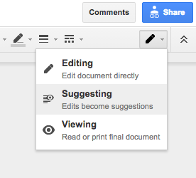
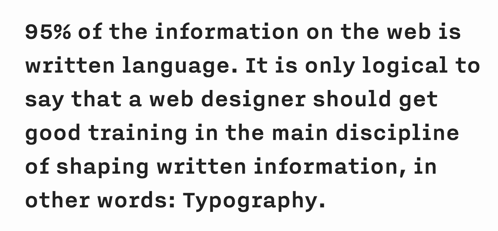
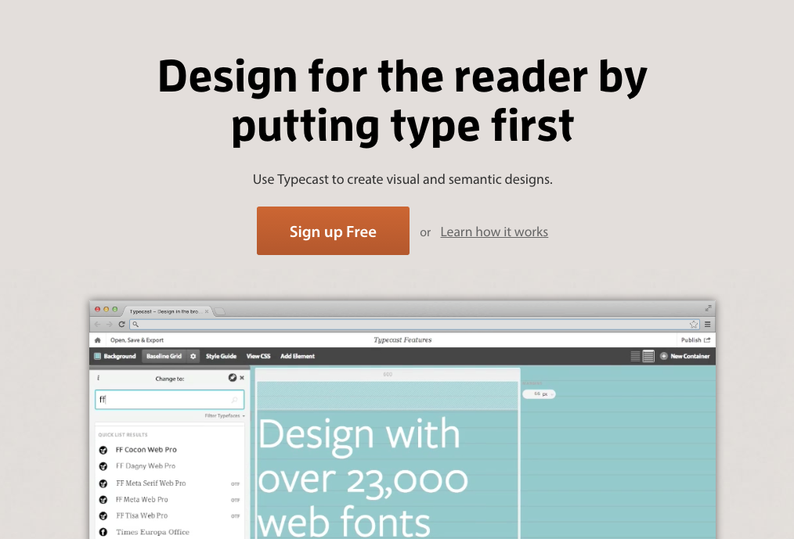

# Week 13

### Today, Friday 29th April 2016

1. [Peer-learning presentations](#peer-learning) 
* [Content strategy](#content-strategy): read out loud and edit!
* Workshop: [typesetting](#typesetting)

Your [homework](#homework) and [blog](#blog)!

# Peer-learning

Design **patterns** are a way to describe *solutions* to common *challenges*. 

[GoodUI](http://goodui.org) is an excellent resource for UI (**U**ser **I**nterface) patterns.

Each team will **present one pattern**. 

* Explain **how** that pattern works and **why**. 
* Show a few **examples** of the pattern in action. Both *good and bad examples*.   
* Explain how you could use that pattern for the Web Media site you're currently designing
* To make your mini-lesson interactive and memorable, ask **questions** to the rest of the class. For instance, you can ask people:
	* if they agree/disagree with a statement
	* guess a fact/figure before you reveal the answer
 	* how they feel about an example you are showing them

Who | What
--- | ----
Rosie & Afsara  | [Social proof](http://goodui.org/#4)
Tom & Francisco | [Telling who it's for](http://goodui.org/#9)
Rajeev & Kaleshe | [Selling benefits](http://goodui.org/#24)
Ajay & Will | [Loss aversion](http://goodui.org/#30)
Josh & Mark | [Icon labels](http://goodui.org/#47) 
Darren & Malore | [Natural language](http://goodui.org/#48)
Akvile & Ben | [Authenticity](http://goodui.org/#65) 
Dean & Melissa | [Putting others first](http://goodui.org/#67)
Jennifer & Joe & Shajee | [Concise copy](http://goodui.org/#69)

### Paste your links (slides, research, inspirations) on [this GDoc.](https://docs.google.com/document/d/1HIpwLhBqKPyxLBTkOX0eIQckrT1QEJfbqi4eUmICmZ4/edit?usp=sharing)

# Content strategy

[Last week](../12) you started working on your website's [**copy**](../12#copy). 

Today we'll **test and edit** your first draft.

## Your turn

### Test!

You'll be working with another team. 

Before you start, switch on the `Suggesting mode` in your GDoc.

1. Team A: choose one part (a couple of paragraphs) of your website *copy* and **read it out loud** to Team B.
* Team B: listen and answer these questions about what you just heard 

	* Who is this copy for?
	* When do users read this? What may they **feel** at that point?
	* What do users **need to know** (in the context of this element)? Is there any information missing? Is there too much information?
	* What must they do now, if anything? Is there a **call to action**? 
	* Are there any bits that **sound clunky** or don't flow?
	* **How else** could this copy be written?
* Team A: take notes about what may need tweaking, jot down comments and ideas.
* Swap roles. Team B read their chosen part to Team A, who listen and comment on it.
* Repeat this test for *at least three parts* of your copy.

### Edit!

Now **edit your draft**: 

* Remove the bits that are not so important
* Integrate those which are missing
* Tweak the other bits to sound like what your audience(s) may want to read.

Here are two excellent resources on *how to write* good Web content. Get inspired!

* [Writing style guide from GOV.uk](https://www.gov.uk/guidance/content-design/writing-for-gov-uk)
* [Voice & tone by Mailchimp](http://styleguide.mailchimp.com/voice-and-tone)

Here's an example of how we collectively edited a sentence:

1. Ravensbourne offers a 3 year programme that <del>opens doors to</del> unrivalled industry links and excellent graduate employment rates
* <del>Ravensbourne offers</del> a 3 year programme **with** unrivalled industry links and excellent graduate employment rates 
* <del>**Become part of**</del> a 3 year programme with unrivalled industry links and excellent graduate employment rates
* **Join** a <del>3 year</del> programme with unrivalled industry links and excellent graduate employment rates 
* Join a programme with unrivalled industry links and excellent employment rates 

# Typesetting

### Content is mostly **text**

**Text** carries [95%](https://ia.net/know-how/the-web-is-all-about-typography-period) of your page's **meaning**, and gives **context** to your media (images, videos etc.)

You can capture people with (more or less moving) images but then you need text to:

* **communicate** precisely the message(s) you want to get across 
* **persuade** people to take action

> Just choosing a font is not typography.

> It is your job as a web designer to make sure that text is **easy and nice to read** on all browsers and platforms. 

> Correct leading (line height), word and letter spacing, active white space, and dosed use of colour help **readability**.

> In summary, treat **text as a User Interface**.

### Your turn

Let's start designing how your text looks. In other words: **typesetting**.

1. *With your team*: read and discuss [10 common typography mistakes](http://www.thedesigncubicle.com/2008/12/10-common-typography-mistakes/)
* *Individually*: go to [typecast.com](https://typecast.com) and sign up. 

	

	Choose one part of your website's copy and paste it into Typecast. 

	Start playing around with fonts, proportions, line-heights, white space and colours. If you like structure, you can try [GridLover](http://www.gridlover.net/try).
	
	**Take screenshots** of each variations you produce (you'll have to submit those at the end of this project).

