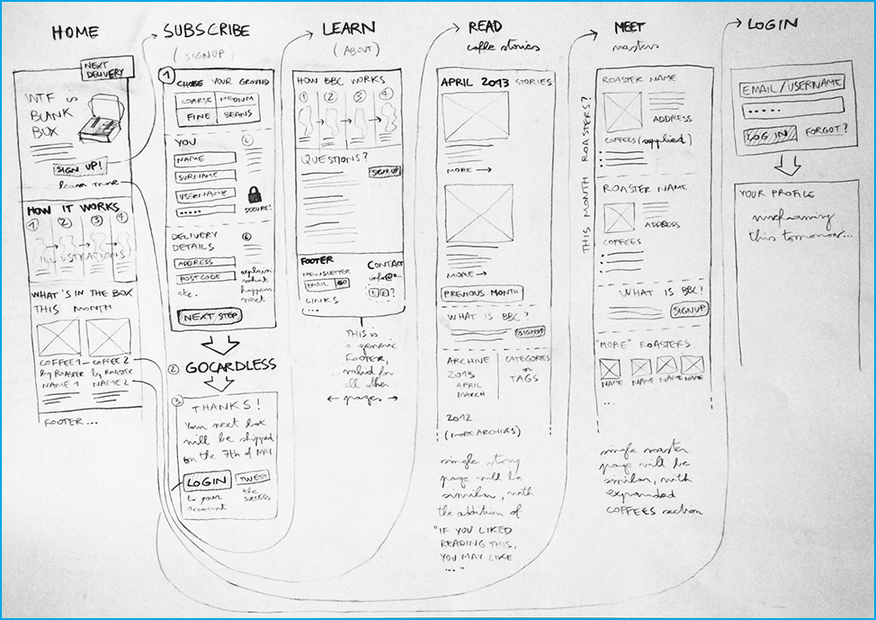
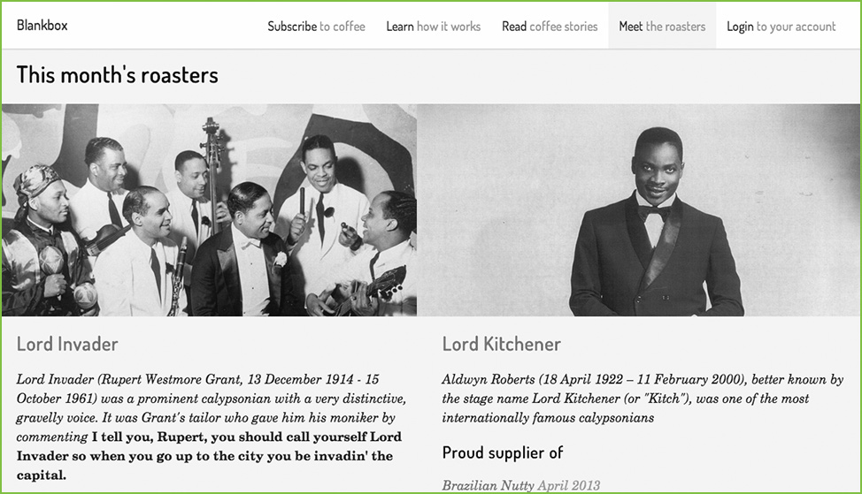
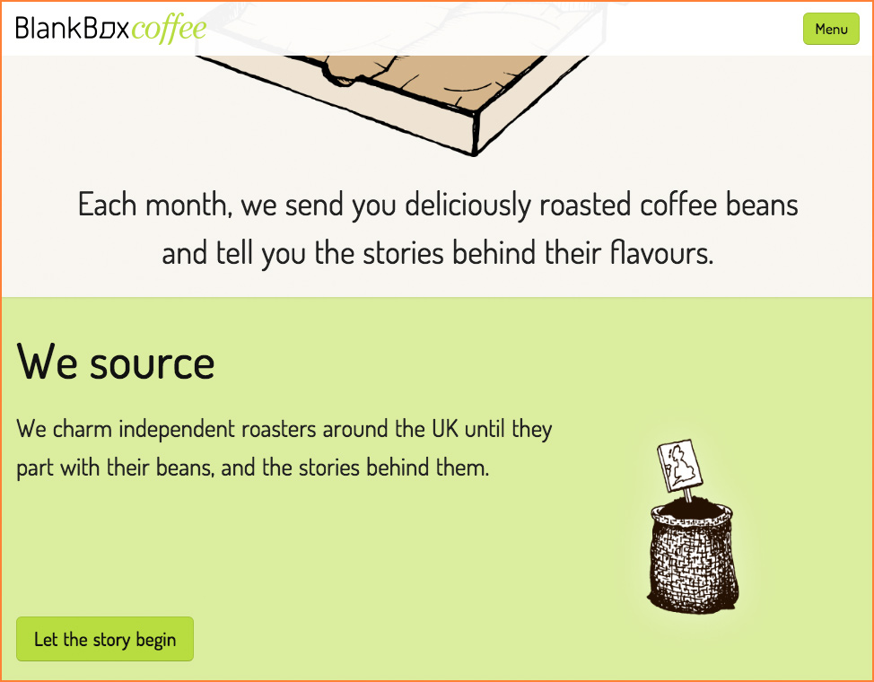
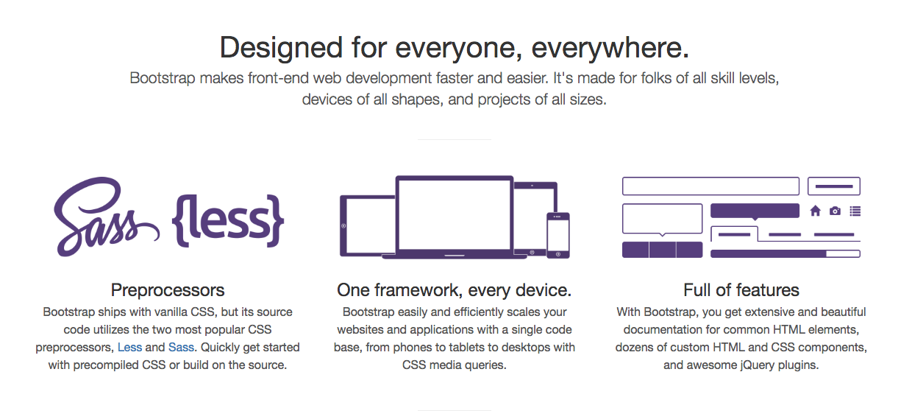
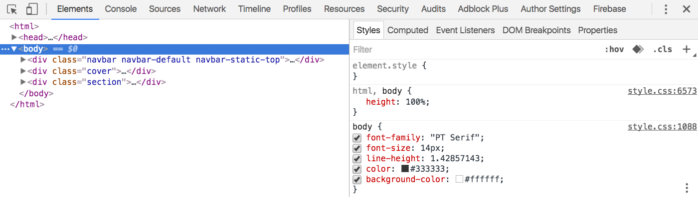

# Week 14

### Today, Monday 8th May 2017

1. [Prototyping with HTML&CSS](#browser-prototyping)
* [Front-end frameworks](#how-to-prototype-with-code)   
* [Tutorials](#tutorials) on *Our space* 


Your [homework](#homework) and [blog](#blog)!


# Browser-prototyping

## The web-design process

*According* to Matteo (and many others):

1. [x] **Research** and **content strategy**: gathering information and thinking through information architecture, navigation and typography
* [x] **Sketches** and **wireframes**: exploring ideas for layouts and content structure
* [ ] **Prototype**: creating 2–3 *key* pages using HTML & CSS. Much of the design process happens here
* [ ] **Development**: building the site (e.g. with WordPress) and refining the design


> The difference between a *good* site and a *great* site is **iteration** — building something, playing with it, refining it.

This **iterative** process helps me **refining ideas** and **focusing** on one thing (usually the *appropriate* thing) at a time. I like starting with type, grid and layout, then add colours and images. 

### Here's an example 

From [BlankBox](https://blankboxcoffee.com), a coffee subscription project Matteo worked on a couple of years ago (sadly not operating anymore):

1. **Design** (a bit of) content strategy + **wireframes** on paper 

		
* **Prototype** with HTML + CSS using Bootstrap (a front-end framework, more on that below) and **iterate** 
	
		
* **Build** the product (with WordPress + many plugins) and **test** it with real people

	
* Back to the *drawing board*...	 
<!-- -->
## Why prototyping with code?

### What about Photoshop?

Photoshop (and similar) allows you to create *static mockups* but doesn't let you design the **states** of an interface: how does your layouts reflow and adapt to different screen sizes, how do interactive elements respond to click touch and other events? 

This is dangerous, as you may end up with an *artist's impression* of a Web page, rather than designing the complex, dynamic thing which is a Web page.

A Photoshop mockup needs to be interpreted (by the coder *translating* it into the real thing) which can lead to a lot of inefficient and unnecessary back-and-forth. 

### **HTML + CSS prototypes** instead...

#### Responsive 

Because they're built with code and you can test them directly in your browser, HTML + CSS prototypes are better at demonstrating **responsive** behaviour.
	
One of the biggest challenges in Web design is the huge and constantly growing number of device screen sizes (here are [286 common ones](http://viewportsizes.com/)).
 
Would you design 286 different mockups in Photoshop?
	
#### Accurate

HTML + CSS prototypes can give you (and your clients) an **accurate representation** of the way your product will really look and function. 
 
For example, *fonts* often look slightly different across various browsers than in Photoshop (and similar). This can cause delays and confusion among clients, who often expect your product to be a *pixel-perfect* match to mockups. See [Make it like the PSD!](http://dangovan.com/make-it-like-the-psd)

#### Consistent 

HTML + CSS prototypes reduce the chances of **errors** and inconsistencies.
	
CSS enforces **consistency** across your design (for instance, applying the same `margin` to all your paragraphs). Making changes is quick and efficient.
	
Photoshop... well, try and change all those buttons from `red` to `green`.

#### Catch real issues, early on

HTML + CSS prototypes allow to **catch potential issues** before they become real problems. 

This provides an early opportunity to adjust how your product works, rather than waiting until front-end development is completed.

#### Save :clock1130: and :moneybag:

In essence HTML + CSS prototypes can **save you time** and money. 

<!-- (and emotional investment) -->

**Your product will be viewed in a browser** so it makes sense to use the browser (and its *native* languages) early on in the creative process, doesn't it?
	
	
## How to prototype with code?

Browser-prototyping is about *translating* your **wireframes** into HTML + CSS.

Starting from scratch is not quick. Better to use a **framework** like [Skeleton](http://getskeleton.com) or [Bootstrap](http://getbootstrap.com) to lay the *foundation* of your prototype. 

**Skeleton** is easier to learn, **Bootstrap** is more complex but also very popular and has lots more hackable themes and tools.

### Meet Bootstrap

Originally designed by Twitter for their own prototyping, it’s become the most popular HTML, CSS, and JS framework for developing *responsive*, *mobile-first* projects on the Web. 

Available to everyone *for free*!

[](http://getbootstrap.com)


# Let's do it

We're going to prototype a couple of pages using Bootstrap

### Tools you'll need

* A browser: Chrome or Firefox (**not** Safari or IE)
* A code editor: [Brackets](http://brackets.io/) or [Atom](https://atom.io/)
* A Bootstrap builder: there are several, we're going to use [Pingendo](http://pingendo.com)

<!--
Bootstrap builders

- [ ] http://blocsapp.com
- [ ] http://brix.io
- [ ] http://www.bootply.com
-->

### Step 1: **assemble the building blocks** in Pingendo

Keep in mind that prototypes are *not* about the final look and feel. You want to keep them *unfinished* and focus on real content and navigation.

Using **Pingendo** assemble the main building blocks of your page: navigation, headings, buttons and paragraphs.

Save your page (the homepage is conventionally named `index.html`).

Don't worry if your prototype doesn't reflect your wireframes at this point. You will tweak it later in the code editor.

### Step 2: **inspect** it in your **browser**

Open your page (eg `index.html`) in your browser.

We're going to use the browser's built-in **Web Inspector** to see what sort of code is behind the prototype we just fleshed out.

> Did you know, you can see the code behind *every* site on the Web? You can use the **Web Inspector** to do this. It's like x-ray specs for websites.

Right-click anywhere on your page, then select `Inspect` (or `Inspect Element` in some browsers).

On the **left panel** of the `Elements` tab you can see all the HTML code for the page you're inspecting. 

By clicking on an HTML element you'll reveal all the CSS applied to it, on the **right panel**. 

* You can **turn CSS properties on and off** by clicking on the checkbox next to them. 
* You can also **edit CSS properties** by double-clicking a property and then typing in a different value.



> You can also change the way *any* website looks (but don't worry, your changes won't affect how other people are experiencing that site). :scream:

Learn all the [advanced stuff you can do in the Web Ispector](https://developer.chrome.com/devtools/docs/dom-and-styles)!

Remember: the Web Inspector is likely the most important tool in your Web-dev toolbox. Make friends with it.

<!--
Chrome Developer Tools

After you created your first prototype in your browser, it’s time to review, test and tweak. The best tools therefore are available for free in every Chrome browser (or Firefox if you prefer).

With a right click on your site you can start the Chrome developer tools which offer you a broad range of features. You can play around with your code, move styles, edit content and much more.
-->
<!--
- [ ] [The ultimate guide to designing in the browser](http://usersnap.com/blog/guide-designing-in-the-browser/)
- [ ] [Tips for designing in the browser](http://webdesign.tutsplus.com/articles/tips-for-designing-in-the-browser--webdesign-10340)
- [ ] [How I rapidly prototype websites](http://blog.teamtreehouse.com/rapidly-prototype-websites)
- [ ] Use Chrome Web-tools inspector
-->

### Step 3: **tweak** it in your **code editor**

We're going to use **Brackets** for this step (Atom should work equally well, but I can't guarantee it has the same tools).

In Brackets, **open the folder** where you saved your page. Open the whole folder, not just `index.html`.

First, clean up the code to make it easier to read:

1. Install the `Beautify` extension from `File` > `Extension Manager...`
* `Edit` > `Beautify` 

It's good practice not to mess around with the Bootstrap source (or any framework's source) but rather keep your changes in separate files. 

1. **Create a new CSS file** to store your own changes to the prototype. 
* Make sure you include the new CSS file in the `head` of your HTML file, like so

	```html
	... existing head code
	<link href="matteo.css" rel="stylesheet" type="text/css">
</head>
```	

Now you can start making tweaks to your prototype, both in HTML and CSS. 

> Pingendo will automatically pick up the changes you make in Brackets, and viceversa.

Keep the [Bootstrap *manual*](http://getbootstrap.com/css) open and look up how its components work.

<!--
* You can **initialise** this task using [Bootstrap](http://getbootstrap.com/) or [Skeleton](http://getskeleton.com/) to lay the foundations of your pages

* First, **structure the content** of your chosen pages with HTML. Decide what tags are appropriate for your content: consider [**semantic** tags](http://www.w3schools.com/html/html5_semantic_elements.asp) like `<header>`, `<footer>`, `<section>` and `<nav>`. Use `<div>` elements as your *last resort*

* Then, apply **design and style** with CSS. If you're using a  boilerplate or framework, don't tamper with their CSS files. Instead, create your own separate `style.css` (or whatever you decide to call it). Even better, create many CSS files, eg: `general-rules.css`, `typography.css`, `colours.css`, `slider.css`, `home.css`...

### Hungry for more CSS tutorials?

You can find loads of animation [tutorials on Codrops](http://tympanus.net/codrops/category/tutorials), using a mix of CSS and SVG (scalable vector graphics).
-->


# Tutorials

### Content + wireframes

* Is anything important missing from this page?
* Is the most important content the first thing you notice?
* Is there anything on this page that shouldn't be there?
* Do you know what all of the elements on this page are?
* Can you get to all of the major sections of the site from here? Should you be able to?
* Do all of the labels make sense?


# Homework

### Keep prototyping 

Prototype **up to 3 HTML pages**. If your project has less than 3 pages, show different *states* for a page, eg: before and after submitting a form.

### Prep formative

[Here is a checklist](../15#formative-presentations) of what we want you to present during your formative on **Monday the 15th**.

### Blog

Choose one of the following Web design *myths* and blog about it.

1. [People don't scroll](http://uxmyths.com/post/654047943/myth-people-dont-scroll)

2. [White space is wasted](http://uxmyths.com/post/2059998441/myth-28-white-space-is-wasted-space)
	
3. [Design has to be original](http://uxmyths.com/post/712377283/myth-9-design-has-to-be-original)

4. [Graphics will make a page element more visible](http://uxmyths.com/post/702072231/myth-graphics-will-make-a-page-element-more-visible)

5. [The homepage is your most important page](http://uxmyths.com/post/717779908/myth-the-homepage-is-your-most-important-page)

6. [Design is about making a website look good](http://uxmyths.com/post/654070104/myth-design-is-about-making-a-website-look-good)

Questions that could guide your blog post (in no particular order):

* Where do you think the *myth* you chose may come from? Eg: *why do some people believe that users don't scroll webpages?*
* Where did you hear about this *myth*? 
* If you feel like it isn't a *myth*, what are the reasons? 
* What are alternative ways to approach the design problem that the *myth* addresses?