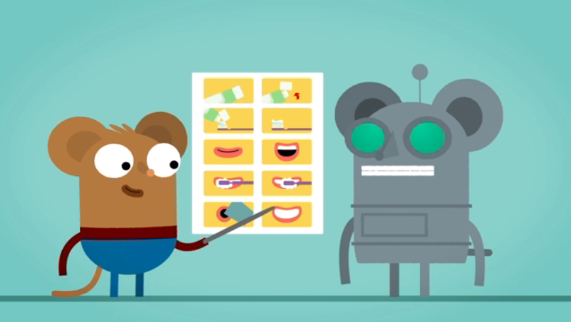
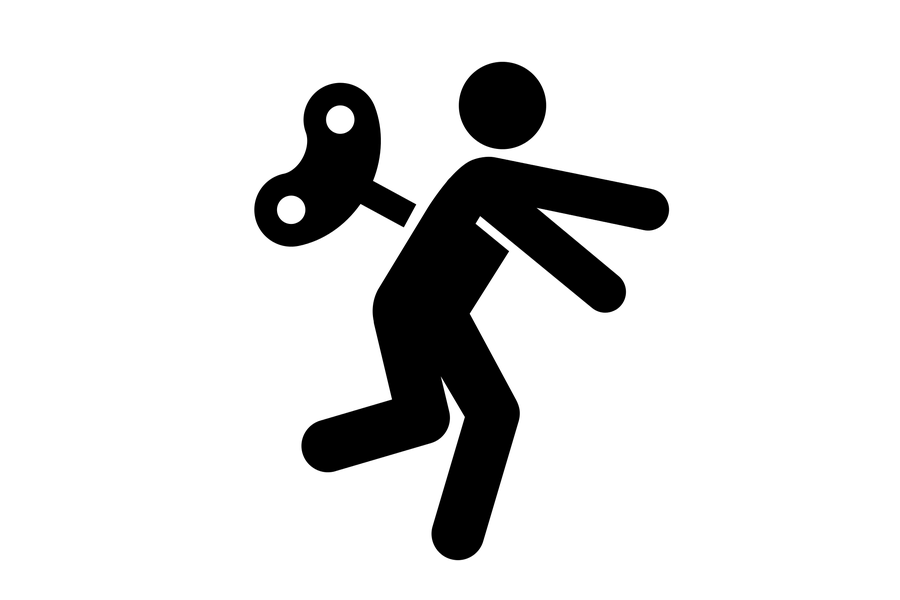

# Week 10

### Today, Friday 17th April 2015

1. POP (principles of programming)
* Meet JavaScript

# Programming vs coding

Do *coding* and *programming* mean the same thing?

* Coding: writing code
* Programming: designing a list of instructions to get something done (aka **algorithm**) and then coding such instructions

[What's an algorithm?](http://www.bbc.co.uk/guides/z3whpv4#zyfwjxs)

Last term we learned how to create the **visual elements** of a Web product (site, page, app etc) using **HTML** + **CSS**. 

<!--We could describe this process as **coding**.-->

To set things in motion, to have a truly interactive experience, we need another ingredient: **JavaScript**.

#### 1. **HTML** → content and structure  

#### 2. **CSS** → style and design 

#### 3. **JS** → behaviour and logic

HTML and CSS are coding languages.

JavaScript is a programming language.

<!--  (together with PHP, Python, Java, Ruby etc) -->

### Robot time!

Let's pretend I'm a **robot** and you have to **program me**.

* **Mission**: find an object in the room, pick it up

* I only understand these **commands**: 
 
	`walk(steps)`
	
	`turn(degrees)` 
 	
 	`grab(thing)`

* I can hear, but can only say `yes` or `no`

<!--People usually start by giving you very *specific instructions* (eg: walk 3 steps, turn 45 degrees, walk 2 steps..): **remote-controlling**

We can then make them their code more *abstract* and *flexible* with **logic** and **functions**.
	
(The idea is to engage people with an [easy task](http://pss.sagepub.com/content/early/2012/08/31/0956797612446024.abstract) before we challenge them with a demanding one)-->
	

### Principles of Programming (POP)

There are lots of programming languages, and they share the same core principles, and the same **building blocks**: 

1. Data → Variables 
* Actions → Functions 
* Decisions → Logic 

Think about the robot game: which variables, functions and logic did we use?

What variables, functions and logic do you use in your everyday life (even if you don't call them so)?

### Natural vs Programming languages 

* `the cat drinks milk` English 
* `de kat drinkt melk` Dutch
* `die Katze trinkt Milch` German 
* `il gatto beve latte` Italian 

Can you see a pattern here?

How about this?

`cat.drink(milk)` JavaScript (written by an English-speaking human)

# Let's code

Meet the **Console**

        var cat = { ... }
        cat.drink = function(beverage) { ... }
        ...
        var milk = ...
        ...
        cat.drink(milk)

### Codio

1. Sign up to [Codio](https://codio.com) 
* Create a new project 

<!--
* Link to GitHub: Tools > Git > Remotes...
	* name: `origin`
	* URL: your GitHhub repo's URL
* open Codio's Terminal and type `git pull origin master` to pull your repo into Codio
* [Install Ungit](http://forum.codio.com/t/install-and-use-ungit-on-codio/885)
-->

* Meet jQuery
* quick win: make something appear and disappear from the page
* second quick win: add an event listener to a button, or to the form submit
* get input values

### APIs 

* Data from the Web
* Don't care what it looks like, just give me the data (see [The interface layer](https://medium.com/bridge-collection/the-interface-layer-when-design-commoditizes-tech-e7017872173a)) and I'll make it work and look proper
* URLs to get and send data, examples

	* Google
	* Facebook (www vs graph)
	* Gender-api
	* Mashape?
	* Edamam

# Assignment

- [ ] TODO