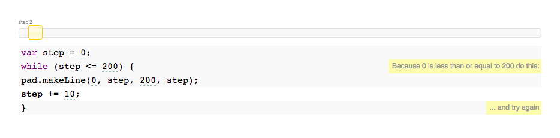

# Week 11

### Today, Friday 24th April 2015

1. [Variables](#variables)
* [Objects](#objects)
* [Functions](#functions)
* [APIs](#apis)
* [Arrays](#arrays)
* [Loops](#loops)
* [Templating](#templating)

Your [homework](#assignments)!

# Building blocks

Different *syntax*, same *building blocks*. No matter which language you're using.

Compare these two programs. 

**JavaScript**
```js
// declare a variable
var weather = "sunny";

// define a function
function greet() {
	if (weather == "sunny") {
		alert("Good morning sunshine!");
	} else {
		alert("Where is the sun today?");
	}
}

// run a function
greet();
```

**PHP**
```php
// declare a variable
$weather = "sunny";

// define a function
function greet() {
	global $weather; 
	if ($weather == "sunny") {
		echo("Good morning sunshine!");
	} else {
		echo("Where is the sun today?");
	}
}

// run a function
greet();
```

### Programming is a **way of thinking**

Before we learn how to *code* a program, we should learn how to *think* about problems and solutions.

**Computational thinking** 

* Not thinking like computers. Do computers think anyway? 
* Solving problems for **people**, using **code**.

It is about using code creatively to solve real-world problems, to **break down behaviours** in specific and precise ways that can be communicated to other people, and eventually to computers.

<!-- I need 4 volunteers --> 

<!--- [ ] [Learnable Programming](http://worrydream.com/LearnableProgramming) -->


## Variables

### When?

Whenever you want a computer to **remember something**.

### Why?

Variables are useful because they let us write programs without knowing the data which will flow through them.

```js
// we don't know their name just yet, but we can define how to greet them
function greet(name) {
	alert("Hello " + name + "!");
}
// we store their name in a variable
var userName = prompt("What's your name?");
// and then we greet them using that variable
greet(userName);
```

### How?

To use a variable, we must 

1. *declare* it: give it a **label**, let the computer know about the variable

	`var myName;`
2. *assign* it: give it a **value**, let the computer know what *value* we are storing in the variable

	`myName = "Matteo";`

#### How do we name them? 

* Variable names should be **clear and meaningful**: `myName` is better than `n` or `name` 
* Variable names should begin with letters, `$` or `_` and only contain letters, numbers, `$` and `_`
* Variable names are **case sensitive**, which means that `myName` is different to `myname` or `MyName` or `MYNAME`
* Variable names cannot be multiple words, so you can use [*camel case*](http://en.wikipedia.org/wiki/CamelCase) for  variables like `userTelephoneNumber`, instead of `usertelephonenumber`.


## Objects

### When?

Whenever you want to store **related values** together.

### Why?

**Objects** are useful to keep things organised.

### How?

To create an object, we *declare* a variable as usual, and then we use *curly brackets* to surround **key-value** property pairs:

```js
var objectName = { 
  propertyName: propertyValue,
  propertyName: propertyValue,
  ...
};
```

For example

```js
var cat = 
{
	name: "Bruno",
	age: 2,
	meow: function() { 
		alert("MEOOOOOOW"); 
	},
	drink: function(beverage) { 
		alert("I am drinking " + beverage); 
	}
}
```

#### How do we access them?

An object is not useful unless we can look inside it and grab the values of its properties. 

We can do that in two ways:

1. using *dot notation*, where we write the name of the variable, followed by a `.` and then the property name

	`cat.name`
	
2. using *bracket notation*, where we write the variable name, then *square brackets* with the property name in speech marks

	`cat["name"]`

#### How do we change them?

We can change the values of the object properties at any time during a program, using the *dot* or *bracket* notation.

`cat.name = "Bob";`

We can also add entirely new properties!

`cat.colour = "brown";`

## Functions

### When?

Whenever we want a computer to **do something**, like capturing an input, making a calculation, comparing data, answering a question, sending data, requesting data, drawing stuff on screen... anything.

### Why?

Functions are useful to **make code reusable and flexible**. For instance, the action of *drinking* remains the same, no matter what you are drinking.

```js
cat.drink = function(beverage) { 
	alert("I am drinking " + beverage); 
}
// let the cat drink various drinks
cat.drink("milk");
cat.drink("tea");
cat.drink("beer");
```

### How?

To use a function, we must

1. *declare* it: give it a **name** and teach the computer about the **steps** required to perform that action

	```js
	function meow() {
		alert("MEOOOOOOW");
	}
	``` 
2. *call* it: tell the computer to **execute** the code inside the function, by writing its name followed by *round brackets*	

	```js
	meow();
	// and again
	meow();
	```

### Arguments

`meow()` is a **reusable** function. How can we make it **flexible**?

```js
function meow(message) {
	alert("MEOOOOOOW " + message);
}
// different messages
meow("I'm hungry");
meow("I need a nap");
``` 

The `message` is a **parameter**, that is a [variable](#variables) which lives inside the `meow` function.

`I'm hungry` and `I need a nap` are called **arguments** ([don't argue, that's what they're called](http://programmers.stackexchange.com/questions/186293/why-are-actual-parameters-called-arguments)) and they are the actual values that we *pass* to a function.

### What happens in a function, stays in a function

There's another powerful thing we can do with functions: we can use them to take in some values, compute them, and then return a new value.

```js
function areYouAnAdult(age) {
  var answer;
  if (age < 18) answer = "no";
  else answer = "yes";
  return answer;
};
```

`return` does two things: 

1. it gives a value back to whoever asked for it 
2. it immediately exits the function

```js
areYouAnAdult(16); // returns "no"
areYouAnAdult(23); // returns "yes"
```

Without `return` we wouldn't know the answer!

## APIs

*Application Programming Interface*... wtf?

### When?

Whenever you want to use to use *3rd party* **data**, **software** or **hardware**.

For example, if you want to embed a map to your app you can use the [Google Maps API](https://developers.google.com/maps), instead of programming a whole new mapping system from scratch.

If you want to add a Twitter feed to your page you can use the [Twitter API](https://dev.twitter.com/rest/tools/console).

If you want to use geographical information about  your users, you can use the [HTML5 geolocation API](http://www.w3schools.com/html/html5_geolocation.asp)

### Why?

> Instead of reinventing the wheel, you can borrow someone else's wheel...

APIs work a bit like a library: 

1. You go to the library **API provider**
* You get a library card **API key**
* You borrow books **data** using your API key
* If you don't play by the rules, the librarian will prevent you from getting more books.

For companies, providing APIs is beneficial for:

* **branding**, eg getting a *Like* button on many other sites
* **control**, eg Twitter control which data you can use from it, how much of it and how you can manipulate it 
* **service improvement**, eg TFL published APIs for their transport data and developers created apps that help people plan their journeys more efficiently (which is good for TFL too)

### How?

You will have to **read the manual**.

Data APIs work with URLs. We can use URLs to **GET data** and **POST data**.

> Like calling a *function* over the Web..

<!--* Data from the Web
* Don't care what it looks like, just give me the data (see [The interface layer](https://medium.com/bridge-collection/the-interface-layer-when-design-commoditizes-tech-e7017872173a)) and I'll make it work and look proper
* 
* URLs to get and send data, examples-->


* To **GET data** from Google Search

	[https://www.google.co.uk/search**?q=banana**](https://www.google.co.uk/search?q=banana)
	
	We add `q=your+search+terms` to the URL and Google will return results for those terms

* To **GET data** from Facebook
	
	[https://**graph**.facebook.com/**RavensbourneUK**](https://graph.facebook.com/RavensbourneUK)
	
	We swap `www` for `graph` and Facebook will return a data object about the person or page we requested
	
* To **GET data** from the [Gender API](https://gender-api.com)

	[https://gender-api.com/**get?name=matteo**](https://gender-api.com/get?name=matteo)

* Many more APIs on [MashAPE](https://www.mashape.com) 

Every API is slightly different in syntax (which is why you have to read their manual), but the core method is the same: sending and receiving data via URLs

<!--Data APIs vs service APIs-->

## Arrays

### When?

When you want to store a list of things that have the **same data structure**.

Data APIs often return **lists** of objects (a list of recipes, a list of photos, a list of posts etc).

Each object contains different data, but has the same data structure.

### Why?

It's useful to have **consistent data structures** when you need to compare a lot of values quickly.

We may want to compare them so that we can sort them (eg the most popular picture, or the recipe with the shortest preparation time).

### How?

To create an array, we declare a variable like we always do, but then we surround our list of values with *square brackets* and separate each value with a comma.

To create an array of **numbers**
```js
var primeNumbers = [2, 3, 5, 7, 11, 13]; 
// the list goes on but we stop here
```

We can store any sort of JavaScript value in an array, not just numbers. Here's an example where we make an array of **strings**

```js
var animals = ["antelope", "zebra", "cat", "dog"]; 
// the list could go on
```

APIs often return arrays of **objects**

```js
var recipes = [
	{
		name: 'Banana bread',
		ingredients: [ ... ],
		picture: 'http://example.com/banana-bread.jpg'
	},
	{
		name: 'Banana fritters',
		ingredients: [ ... ],
		picture: 'http://example.com/banana-fritters.png'
	}
];
// the list could go on
```

#### How long?

To know how long an array is, we can use its `length` property

`recipes.length`

#### How do we access them?

To access a particular value in an array, we use its **index**, which represents its *position* in the array. 

The first index in an array is `0`, so if we want to access the first element in an array, we specify the name of the array variable, then `0` in *square brackets*

```js
var animals = ["antelope", "zebra", "cat", "dog"]; 

animals[0] // "antelope"
animals[2] // "cat"
```

The **zero-based indexing** is one of the most confusing aspects of arrays for new programmers :scream_cat:

#### How do we change them?

To change a value

```js 
animals[1] = "crocodile";
```

We can also add entirely new values to them, using the `push()` function

```js 
animals.push("penguin");
```


## Loops

### When?

Whenever you want to take some action for every element in an array.

### Why?

Instead of writing (almost) the same code over and over, we can use a loop to **iterate through each element** in the array.

### How?

Loops are super-common in programming.

```js
var people = ["Danny","Chris","George","John","Paul","Ringo"];
var counter = 0;
var total = people.length;
while (counter < total) {
  var person = people[counter];
  console.log(person);
  counter = counter + 1;
}
```

There are four ingredients to a loop:

1. An `array`
2. A `counter` variable, to keep track of the array element we're manipulating at each iteration of the loop
3. A `while` statement, which keeps checking for a condition (in this case, whether the counter is smaller than the total number of elements in the array)

	**While the condition is `true`** the computer will execute the code block inside `{ ... }`

4. Don't forget to **increment** the `counter` at the end of the loop, otherwise you'd get a dreaded **infinite loop** (and your browser would probably crash).

[](https://jsfiddle.net/baddeo/HLR85/10/embedded/result/)

<!--use `while` and Choc-->


## Templating

### When?

Whenever you have *raw data* that needs to be *dressed up*. 

### Why?

Separation of concerns. Data > presentation

### How?

```js
// this function is like an HTML sausage machine
// pass in some recipe data
// and it will return an HTML list item wrapped around that data
function getRecipeListItem(recipe)
{
	// create a variable to store the HTML code
	// we put the static (non variable) bits in speech marks
	// and the variable bits outside of speech marks
    var li = "<li>"
        + ""
        + "<h3>" + recipe.label + "</h3>"
        + "<p>This recipe is <b>" + recipe.level + "</b> and will take you " + recipe.totalTime + " minutes to prepare.</p>"
        + "<a href=" + recipe.url + " target=_blank>Let's make this recipe</a>"
        + "</li>"

    return li    
}
```

# Resources

[JavaScript for cats](http://jsforcats.com) is an interactive, easy introduction to JavaScript. 

Intended audience: *cats*.

[](http://jsforcats.com)


# Assignments

1. Start translating your wireframes into HTML & CSS pages
2. Learn and blog about [jQuery event handling](http://jqfundamentals.com/chapter/events)


<!-- 

logic?
https://www.khanacademy.org/computing/computer-programming/programming/logic-if-statements/a/review-logic-and-if-statements

loops
https://www.khanacademy.org/computing/computer-programming/programming/looping/a/review-looping

-->


