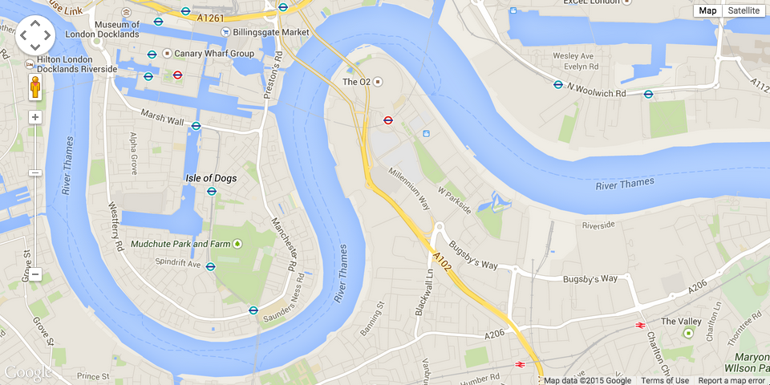
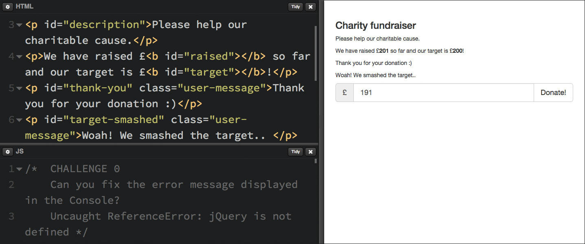

# Week 12

### Today, Friday 1st May 2015

1. [HTML+CSS wireframes review](#wireframes-review)
* [Meet the Google Maps API](#meet-the-google-maps-api) 
* [Debugging](#debugging)
* [Challenge](#debugging-challenge)!
* [Recipes app](#recipes-app)

Your [homework](#tasks)!


<!-- Managing online content with WordPress -->


# Wireframes review

5 minutes each

* Is anything important missing from this page?
* Is there anything on this page that shouldn't be there?
* Can you get to all of the major sections of the site from here? Should you be able to?
* Do all of the labels make sense?

* What is your *workflow*?
* Which framework / boilerplate are you using, and why?
* Let's see the **source code**..
* Check the [semantics](http://www.w3schools.com/html/html5_semantic_elements.asp) of your HTML elements: could you use `<header>`, `<footer>`, `<section>` and `<nav>` instead of `<div>` elements for instance?


# Meet the Google Maps API

Based on [this tutorial](https://developers.google.com/maps/tutorials/fundamentals/adding-a-google-map)...




```html
<!DOCTYPE html>
<html>
  <head>
    <style>
      #map-canvas {
        width: 500px;
        height: 400px;
      }
    </style>
    <script src="https://maps.googleapis.com/maps/api/js"></script>
    <script>
      function initialize() {
        var mapCanvas = document.getElementById('map-canvas');
        var mapOptions = {
          // Ravensbourne's coordinates
          center: new google.maps.LatLng(51.501499, 0.005374),
          // zoome goes from 3 to 21
          zoom: 13,
          // ROADMAP, SATELLITE or TERRAIN
          mapTypeId: google.maps.MapTypeId.ROADMAP
        }
        var map = new google.maps.Map(mapCanvas, mapOptions)
      }
      google.maps.event.addDomListener(window, 'load', initialize);
    </script>
  </head>
  <body>
    <div id="map-canvas"></div>
  </body>
</html>
```


# Debugging

Why *debugging*? So the [story goes](http://en.wikipedia.org/wiki/Debugging#Origin): one morning Grace Hopper found an actual bug stuck in one of the relays of a computer she was working on...


When programming, things don't always go as expected.

Imagine yourself as a *scientist*: you formulate a **hypothesis** about how the computer is going to interpret and execute your code. When you test that code, your hypothesis doesn't yield the results you're expecting.

For example, you're expecting a `function` to be triggered when someone clicks a `button`. When you click that button, nothing happens.. or even worst, the button click trigger works for you but not for your friend / colleague / client!

What to do?

#### 1. Find a way to reproduce the problem

What are the steps required to make the bug happen consistently? 
	
Is there any particular hardware / software configuration for the bug to surface? Eg: it only happens on iOS devices, or Internet Explorer 9
	
#### 2. Track down the origin of the problem

You may have to simplify your code, for instance creating a reduced version of your program with only a few lines from the original source code, where the bug still happens.
	
This removes complexity and prevents us from being side-tracked by unrelated issues.
	
#### 3. Study the problem

This is the crucial part. No matter which language you're programming in, it's essential to have a strategy for *seeing the state* of your program when it executes.
	
If you use JavaScript and debug your code in a Web browser, you can use the [Console](http://webmasters.stackexchange.com/a/77337) and [breakpoints](https://developer.chrome.com/devtools/docs/javascript-debugging) to see the state of your program. 
	
* If you have a **syntax error**, the Console will tell you where that error is (file name and line number), as well as a semi-useful indication of what the error may be
```js
Uncaught SyntaxError: Unexpected end of input       main.js:5
```	

* If you have a **data error**, the Console will tell you where that error is (file name and line number), as well as a semi-useful indication of what the error may be
```js
Uncaught ReferenceError: jQuery is not defined       main.js:25
```	

* If you have a **conceptual error** (nothing is technically wrong but things are not happening as expected) you can use `console.log(someVariable)` to see if your program is being fed the expected data, and/or using **breakpoints** to see if the program is hitting a certain point of execution.

#### 4. Ask Google

See if someone else had (and hopefully fixed) the same problem.

The more specific you are about your problem, the more relevant results you should find. Especially on places like [StackOverflow](http://stackoverflow.com)

#### 5. Fix, test and repeat	


# Debugging challenge

Your turn!

Go to [this pen on CodePen](http://codepen.io/baddeo/pen/YXPpwV?editors=001) and **fork** it (a fork is like a photocopy, for code).

[](http://codepen.io/baddeo/pen/YXPpwV?editors=001)

1. Open the *debug* version of your forked pen
2. Right-click anywhere on that page, choose *Inspect Element*
3. Click [**Console**](http://webmasters.stackexchange.com/a/77337) from the panel that will pop up

There are **6 challenges** for you to solve!


# Recipes app

Last week we started building a [recipes app](resources/recipe-app)

What's missing:

* style the interface (make it responsive)
* clear previous search results 
* tell people [something is happening]([visibility of system status](http://www.nngroup.com/articles/ten-usability-heuristics/)) after they hit the *Search* button
* anything else?


# Tasks


<!-- 

Programming  quiz 

https://www.khanacademy.org/computing/computer-programming/html-css-js/html-css-js-intro/e/quiz--javascript-recap

-->

