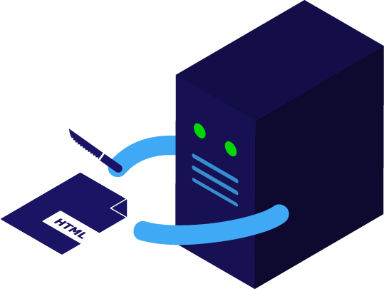

# Week 13

### Today, Friday 8th May 2015

1. [Programming on the server](#programming-on-the-server)
* Meet WordPress

Your [homework](#assignment)!

<!--Understanding the WordPress loop-->

# Programming on the server

### What's a server?

Just a computer that is **always on**, **connected** to the Internet and ready to accept **HTTP requests** and serve documents (HTML, CSS, JS, images etc) in **response**.

### Can I run a WebServer on my computer?

Yes!

[WAMP](http://www.wampserver.com/en/#wampserver-64-bits-php-5-3) is for Windows, [MAMP](https://www.mamp.info/en) is for Mac (well, now for Win too), [XAMPP](https://www.apachefriends.org) is for both (+ Linux)

[Vagrant](https://www.vagrantup.com/downloads.html) + [VirtualBox](https://www.virtualbox.org/wiki/Downloads)

<!-- [vccw](http://vccw.cc) -->

<!--[ServerPress](https://serverpress.com)-->

<!-- http://wptavern.com/13-vagrant-resources-for-wordpress-development 

https://github.com/chad-thompson/vagrantpress/tree/master/puppet -->

[Bitnami](https://bitnami.com/stack/wordpress) (easier but heavier)

### Meet PHP

When we develop for the browser (*front-end*), there is only one programming language available to us: Javascript. 
On the *back-end* or **server-side** we can choose whichever language we want.

[PHP](http://php.net) is a popular programming language for Web servers, because it underpins websites like WordPress and Facebook, but also because it has been around a long time. 

# WordPress

- [ ] TODO

<!--http://www.smashingmagazine.com/2011/09/28/developing-wordpress-locally-with-mamp/

http://polevaultweb.com/2014/03/5-ways-synchronise-wordpress-uploads-across-environments/ particularly `#4` seems like a smart solution

http://ftploy.com/ tracks a Git repo and deploys automatically

http://wp-cli.org/ is a command line interface for WordPress

https://plausiblethought.net/wordpress-git-workflow/-->

# Assignment

- [ ] TODO