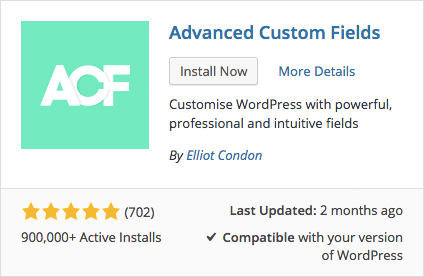
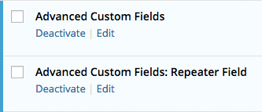
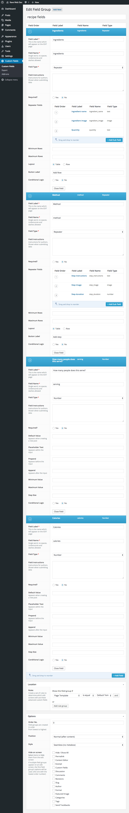
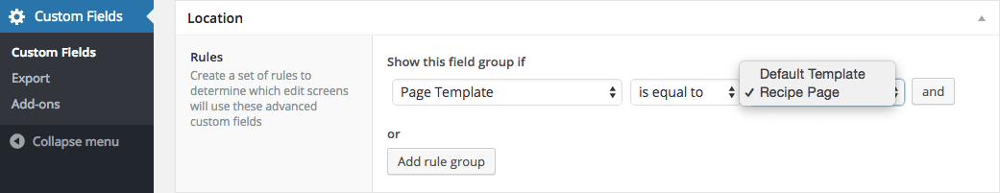

# Week 14

### Today, Friday 15th May 2015

1. [Meet WordPress](#meet-wordpress)
* [Pimp your WordPress](#pimp-your-wordpress) 
* [Advanced Custom Fields in action](#advanced-custom-fields-in-action)
* [WP templates in action](#templating-a-recipe)

Your [homework](#assignments)!


# Meet WordPress

Have you installed it **locally**?


* How did you do it? 
* What worked? What didn't?
* What have you learned? 

- [ ] Show what the *success* pages look like


### Quiz

1. wordpress**.com** and wordpress**.org** are the same

	- [ ] True	
	- [ ] False 
	- [ ] It depends 
	
	<!-- False -->
* WordPress is a

	- [ ] Community Management System
	- [ ] Content Management Service
	- [ ] Cattle Milking Society
	- [ ] Content Management System 
	- [ ] Code Management System
	
	
	<!-- Content Management System -->
* WordPress is **written** in 

	- [ ] stone
	- [ ] HTML
	- [ ] PHP
	- [ ] JavaScript
	- [ ] Python

	<!-- PHP -->
* WordPress **stores data** in a 

	- [ ] MongoDB database
	- [ ] MySQL database
	- [ ] bucket
	- [ ] Microsoft SQL database
	- [ ] Google Spreadsheet

	<!-- MySQL -->	
* The main **administration screen** is the

	- [ ] Toolbar
	- [ ] Theme
	- [ ] Login
	- [ ] Dashboard
	
	<!-- Dashboard -->
* To access your ***local* WP Dashboard** you go to
	
	- [ ] `localhost/wp/dashboard`
	- [ ] `localhost/admin/wp-admin`
	- [ ] `localhost/wp-admin`
	- [ ] `localhost/admin-wp`
	
	<!--  .../wp-admin -->
* In WordPress you can add these **types of *content***

	- [ ] Posts and Posters
	- [ ] Pages and Posts
	- [ ] Pages and Messages
	- [ ] Messages and Posts
	
	<!-- Pages and Posts -->
* What is a ***post*** in WordPress?
	
	- [ ] A blog post
	- [ ] A collection of links
	- [ ] A content entry listed in reverse chronological order	
	- [ ] An entry such as *about*, *privacy policy*, *legal disclaimers* etc
	
	<!-- blog post & reverse chronological order -->
* What is a ***page*** in WordPress?
	
	- [ ] A blog post
	- [ ] A collection of posts
	- [ ] A hierarchical, timeless, *one-off* entry
	- [ ] A list of tags

	<!-- one-off -->
* What does WP call the images, videos, audios and files you **upload** and use in your posts and pages?

	- [ ] Archives
	- [ ] Plugins
	- [ ] Stuff
	- [ ] Media
	- [ ] Extensions
	
	<!-- media-->
* What is a ***tag*** in WordPress?
 
	- [ ] A bit of HTML
	- [ ] A piece of graffiti featuring text
	- [ ] A keyword to organise your content
	- [ ] A shortcode
	- [ ] A loose lock of hair
	
	<!-- keyword -->
* To **extend the functionality** of your WordPress you add:
	
	- [ ] Tools
	- [ ] Apps
	- [ ] Plugins
	- [ ] Thingies

	<!-- plug-in -->


<!--
* Will your WordPress blog have the same visual styling as the administration panel?
	
	- [ ] Only if the back-end code is edited to allow it
	- [ ] No
	- [ ] Yes
	- [ ] Only if an option for it is checked off during registration

* Which function should be used to include header.php template file?
	
	- [ ] `return_header`
	- [ ] `the_header`
	- [ ] `wp_header`
	- [ ] `get_header`

* Which required file in Wordpress has the markup for blog posts (i.e. "the loop")?
	- [ ] main.php
	- [ ] post.php
	- [ ] template.php
	- [ ] blog.php
	- [ ] index.php


 quiz questions adapted from http://smarterer.com/tests/wordpress-user -->


<!--[WP plugin for Chrome Logger](https://github.com/ravinderk/wp-chrome-logger)

[WP Debug Objects](https://github.com/bueltge/Debug-Objects)


http://www.smashingmagazine.com/2011/09/28/developing-wordpress-locally-with-mamp/

http://polevaultweb.com/2014/03/5-ways-synchronise-wordpress-uploads-across-environments/ particularly `#4` seems like a smart solution

http://ftploy.com/ tracks a Git repo and deploys automatically

http://wp-cli.org/ is a command line interface for WordPress

https://plausiblethought.net/wordpress-git-workflow/-->


# Pimp your WordPress


You can turn a basic WP site into many different things


### **Plugins** you should install

* [Advanced Custom Fields](https://wordpress.org/plugins/advanced-custom-fields/) lets you create your own data fields to make your **content flexible** and your **data well-structured**. 
 	
 	
 	
 	> You can customise your pages and posts with over 20 field types: text, textarea, wysiwyg, image, file, page link, post object, relationship, select, checkbox, radio buttons, date picker, true / false, repeater, flexible content, gallery and more
 	
 	[Repeater Field](http://www.advancedcustomfields.com/add-ons/repeater-field/) is also very useful. Not free, but worth the little fee if you're building a site for clients, or even for yourself, or friends..

* [Post Tags and Categories for Pages](https://wordpress.org/plugins/post-tags-and-categories-for-pages/) allows you to organise your pages with categories and tags (by default only for posts)
 
* [Duplicate Post](https://wordpress.org/plugins/duplicate-post/) lets you quickly *clone* a post or page

* [WP Sync DB](https://github.com/wp-sync-db/wp-sync-db) lets you push, pull, and sync database tables between WordPress sites (eg between your local WP and your client's hosted site)

* [WordPress SEO](https://wordpress.org/plugins/wordpress-seo/) helps you write *better* content and optimise it for search engines (SEO = Search Engine Optimisation)

* Any other plugins you recommend?


### Advanced Custom Fields in action!

I'll show you how to use [Advanced Custom Fields](https://wordpress.org/plugins/advanced-custom-fields/) to structure the data for a recipe.

In every **recipe** we can identify separate pieces of **data**:

* recipe name
* ingredients list
	* ingredient name
	* ingredient quantity
	* picture? 	
* method steps
	* step description
	* step duration?
	* tools needed? 
* picture(s)
* preparation time
* difficulty level
* number of servings
* etc.

By **default WordPress** gives us

* title
* content
* featured image

Shoving the whole recipe in the *content* box is **not a good idea**.

Using ACF we can separate out all the pieces of data that make up a recipe, making it

* easier to **customise the style and layout** of our recipes (better life for designers and developers)
* easier to ensure **consistency** across different recipes (better life for editors)
* easier to **create and edit** recipes without tampering with code (better life for chefs and content creators) 

By separating out our content with ACF, we make our content more **flexible** and our data more **portable**. 

> Before proceeding, make sure that you have both ACF and  Repeater Field installed

> 

 


# Templating a recipe

In your active theme folder (`wp-content/themes/YOUR_ACTIVE_THEME_NAME`), make a new file and call it `template-recipe.php` 

```php
<?php
/**
 * Template Name: Recipe Page
 */

get_header(); ?>

	<div id="primary" class="content-area">
		<main id="main" class="site-main" role="main">

		<?php
		// Start the loop.
		while ( have_posts() ) : the_post();
		?>	
			<p>How many people does this recipe serve? <?php the_field('serving'); ?></p>
			<p>How many calories? <?php the_field('calories'); ?></p>
			<h2>Ingredients</h2>
			<ul>
				<!-- PHP loop through the repeater -->
				<?php
				// check if the repeater field has rows of data
				if( have_rows('ingredients') ):
				 	// loop through the rows of data
				    while ( have_rows('ingredients') ) : the_row();
				?>        
				    <li> 
			        	<?php the_sub_field('ingredient_name'); ?>

			        	<?php $image = get_sub_field('ingredient_image'); ?>
			        	">
			        </li>
					
				<?php
				    endwhile;
				endif;
				?>
			</ul>

			<h2>Method</h2>
			<ol>
				<!-- PHP loop through the repeater -->
				<?php

				// check if the repeater field has rows of data
				if( have_rows('method') ):

				 	// loop through the rows of data
				    while ( have_rows('method') ) : the_row();

					?>
				        
				        <li> <?php the_sub_field('step_instructions'); ?> </li>
					
					<?php

				    endwhile;

				else :

				    // no rows found

				endif;

				?>
			</ol>
		
			<!-- This is an island of HTML in the PHP ocean -->
		
		<?php
			// If comments are open or we have at least one comment, load up the comment template.
			/*if ( comments_open() || get_comments_number() ) :
				comments_template();
			endif;*/

		// End the loop.
		endwhile;
		?>

		</main><!-- .site-main -->
	</div><!-- .content-area -->

<?php get_footer(); ?>
```

> **HEADS UP!**

> In Advanced Custom Fields make sure that **Recipe Page** is  selected as the template to show *recipe fields*

> 


# Assignments

### ACF

1. Pick a page on the site you're designing.
2. Separate out the pieces of data that make up that page
3. Create *Advanced Custom Fields* for each data piece. See how we chopped up [custom fields for a recipe above](#advanced-custom-fields-in-action).

### Template

In your active WP theme, make a *template* for your chosen page and get it to display all the custom fields for that specific page.

See how we created a [template for a recipe above](#templating-a-recipe).

We'll review your attempts and share *tips&tricks* in the next session together.
