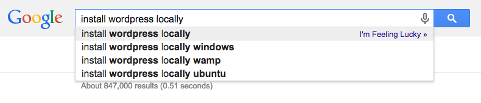

# Week 14

### Today, Friday 15th May 2015

1. [Meet WordPress](#meet-wordpress)
* WordPress templates
* Advanced custom fields

Your [homework](#assignment)!

# Meet WordPress

Have you installed it **locally**?

* How did you do it? 
* What worked? What didn't?
* What have you learned? 

### Quiz

1. wordpress**.com** and wordpress**.org** are the same

	- [ ] True	
	- [ ] False 
	- [ ] It depends 
	
	<!-- False -->
* WordPress is a

	- [ ] Community Management System
	- [ ] Content Management Service
	- [ ] Cattle Milking Society
	- [ ] Content Management System 
	- [ ] Code Management System
	
	
	<!-- Content Management System -->
* WordPress is written in 

	- [ ] HTML
	- [ ] PHP
	- [ ] JavaScript
	- [ ] Python
	- [ ] stone

	<!-- PHP -->
* WordPress stores data in a 

	- [ ] MongoDB database
	- [ ] MySQL database
	- [ ] bucket
	- [ ] Microsoft SQL database
	- [ ] Google Spreadsheet

	<!-- MySQL -->	
* The main administration screen is the

	- [ ] Toolbar
	- [ ] Theme
	- [ ] Login
	- [ ] Dashboard
	
	<!-- Dashboard -->
* To access your *local* WP Dashboard, you go to
	
	- [ ] localhost/wp/dashboard
	- [ ] localhost/admin/wp-admin
	- [ ] localhost/wp-admin
	- [ ] localhost/admin-wp
	
	<!--  .../wp-admin -->
* In WordPress you can add these types of *content* 

	- [ ] Posts and Posters
	- [ ] Pages and Posts
	- [ ] Pages and Messages
	- [ ] Messages and Posts
	
	<!-- Pages and Posts -->
* What is a *post* in WordPress?
	
	- [ ] A blog post
	- [ ] A collection of links
	- [ ] A content entry listed in reverse chronological order	
	- [ ] An entry such as *about*, *privacy policy*, *legal disclaimers* etc
	
	<!-- blog post & reverse chronological order -->
* What is a *page* in WordPress?
	
	- [ ] A blog post
	- [ ] A collection of posts
	- [ ] A hierarchical, timeless, *one-off* entry	- [ ] A list of tags

	<!-- one-off -->
* What does WP call the images, videos, audios and files you upload and use in your posts and pages?

	- [ ] Archives
	- [ ] Plugins
	- [ ] Stuff
	- [ ] Media
	- [ ] Extensions
	
	<!-- media-->
* To extend the functionality of your WordPress you add:
	
	- [ ] Tools
	- [ ] Apps
	- [ ] Plugins
	- [ ] Thingies

	<!-- plug-in -->
* A *tag* in WordPress is
 
	- [ ] A bit of HTML
	- [ ] A piece of graffiti featuring text
	- [ ] A keyword to organise your content
	- [ ] A shortcode
	- [ ] A loose lock of hair
	
	<!-- keyword -->

<!--
* Will your WordPress blog have the same visual styling as the administration panel?
	
	- [ ] Only if the back-end code is edited to allow it
	- [ ] No
	- [ ] Yes
	- [ ] Only if an option for it is checked off during registration

* Which function should be used to include header.php template file?
	
	- [ ] `return_header`
	- [ ] `the_header`
	- [ ] `wp_header`
	- [ ] `get_header`

* Which required file in Wordpress has the markup for blog posts (i.e. "the loop")?
	- [ ] main.php
	- [ ] post.php
	- [ ] template.php
	- [ ] blog.php
	- [ ] index.php

 quiz questions adapted from http://smarterer.com/tests/wordpress-user -->

<!--[WP plugin for Chrome Logger](https://github.com/ravinderk/wp-chrome-logger)

[WP Debug Objects](https://github.com/bueltge/Debug-Objects)

http://www.smashingmagazine.com/2011/09/28/developing-wordpress-locally-with-mamp/

http://polevaultweb.com/2014/03/5-ways-synchronise-wordpress-uploads-across-environments/ particularly `#4` seems like a smart solution

http://ftploy.com/ tracks a Git repo and deploys automatically

http://wp-cli.org/ is a command line interface for WordPress

https://plausiblethought.net/wordpress-git-workflow/-->

# Crafting WordPress templates

# Assignment

- [ ] TODO