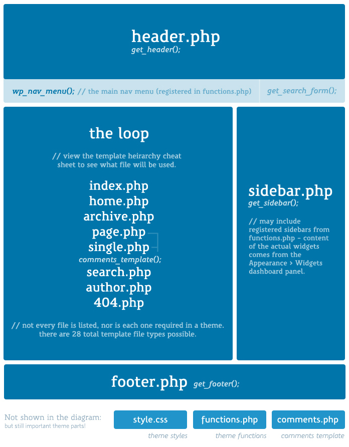
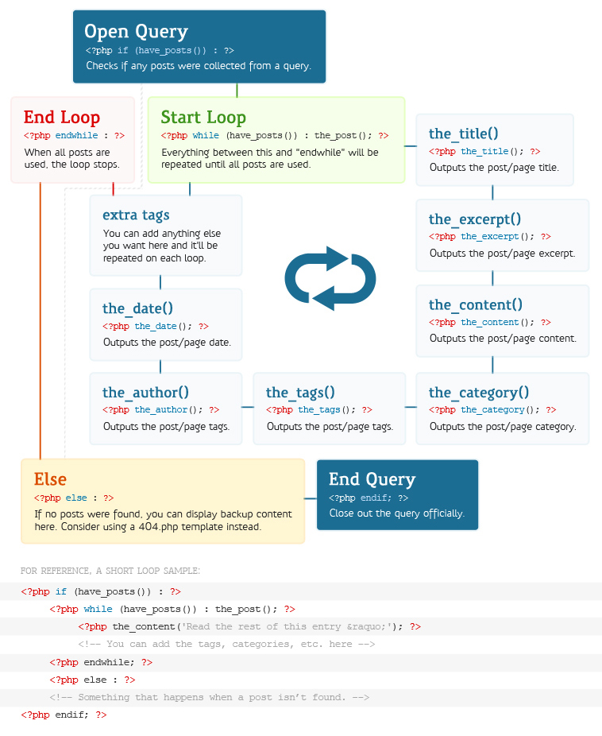

# Week 15

### Today, Friday 22st May 2015

* [Homework review](#homework-review)
* [Data design principles](#data-design-principles)
* [WordPress anatomy](#wordpress-anatomy)
* [The *loop*](#the-loop)
* [Crafting WordPress themes](#crafting-wordPress-themes)


# Homework review

* How did you break the data for your pages into *logical pieces* using [ACF](https://wordpress.org/plugins/advanced-custom-fields/)?
* How did you display your custom fields in your templates?
* What did you learn in the process? Share *tips&tricks*


# Data design principles

### Break your data into logical pieces

Also known as [1NF](http://en.wikipedia.org/wiki/First_normal_form) (first normal form). 
	
Bad:
	 
| Student | 
| ------ |
| Danny Base 21 |

Better:

| Student name | Student surname | Student age | 
| ------ | ---	| --- |
| Danny | Base | 21 |

This way we can take specific bits of data and spit them out  wherever and however we want in our templates.

Also, we could do things like `calculate the average age of our students`.

<!--#### Do not overdo 1NF

| Regional code | Area code | Phone number | 
| ------ | ---	| --- |
| +44 | 02 | 123456578 |

Is it really necessary to break a phone number down that much?-->

### Break it into multiple *dimensions*

Using arrays, aka the [repeater field](http://www.advancedcustomfields.com/add-ons/repeater-field/).

Bad:

| Name | Ingredients | Method |
| ------ | ---	| --- |
| Banana bread | 1 banana <br>1 cup of flour <br>pinch of salt | 1. Mix dry ingredients <br>2. Mash the banana <br>3. Mix it all together <br>4. Bake it for 30 minutes | 
| Avocado on toast | 1 avocado <br>2 slices of bread <br>squeeze of lemon | 1. Toast bread <br>2. Scoop out avocado <br>3. Spread avocado on toast <br>4. Squeeze lemon on top | 

Better:

<table>
	<tr>
		<th>Name</th>
		<th>Ingredients</th>
		<th>Method</th>
	</tr>
	<tr>
		<td>Banana bread</td>
		<td>
			<table>
				<tr>
					<th>Quantity</th>
					<th>Unit</th>
					<th>Name</th>
				</tr>
				<tr>
					<td>1</td>
					<td></td>
					<td>banana</td>
				</tr>
				<tr>
					<td>1</td>
					<td>cup</td>
					<td>flour</td>
				</tr>
				<tr>
					<td>1</td>
					<td>pinch</td>
					<td>salt</td>
				</tr>
			</table>	
		</td>
		<td>
			<table>
				<tr>
					<th>Order</th>
					<th>Description</th>
				</tr>
				<tr>
					<td>1</td>
					<td>Mix dry ingredients</td>
				</tr>
				<tr>
					<td>2</td>
					<td>Mash the banana</td>
				</tr>
				<tr>
					<td>3</td>
					<td>Mix it all together</td>
				</tr>
				<tr>
					<td>4</td>
					<td>Bake it for 30 minutes</td>
				</tr>
			</table>	
		</td>
	</tr>
</table>


### Don't repeat yourself!

Also known as [DRY](http://en.wikipedia.org/wiki/Don%27t_repeat_yourself). 

> Every piece of knowledge must have a single, unambiguous, authoritative representation within a system.

Bad:
	 
| Name | Surname | Course | 
| ------ | ---	| --- |
| Danny | Base | Web Media |
| Chris | Blogs | Web Media Ravensbourne |
| Jordan | Scripts | Ravensbourne Web Media |

Better:

| ID | Name | Surname | Course | 
| ------ | ---	| --- |
| 1 | Danny | Base | 1 |
| 2 | Chris | Blogs | 1 |
| 3 | Jordan | Scripts | 1 |

| ID | Title | Description | 
| ------ | ---	| --- |
| 1 | Web Media | Bla bla |
| 2 | Product Design | Bla bla and blah |
| 3 | Graphic Design | Even more bla |

This way course information is stored only once in a separate table, which we can reference consistently. 

If we want to change the name of a course, we can do it once on the `courses` table and then the `students` table will automatically pull the right information.


# WordPress anatomy

### How does WP generate pages?

It all starts with the **URL**... 

WordPress will look at the URL you requested and try to work out if there is a database entry that matches that URL.

For example, if you request `http://localhost/about-me` WP will check if there's an entry saved as `about-me` and then use the appropriate template to generate the HTML for that entry.

Here are the templates WP typically uses, depending on the entry type

| Type 	| Template 	| 
| ---		| ------		|
| post	| wp-content/themes/YOUR_ACTIVE_THEME/**single.php** |
| page	| wp-content/themes/YOUR_ACTIVE_THEME/**page.php** |
| search	| wp-content/themes/YOUR_ACTIVE_THEME/**search.php** |
| archive	| wp-content/themes/YOUR_ACTIVE_THEME/**archive.php** |
| none of the above	| wp-content/themes/YOUR_ACTIVE_THEME/**404.php** |

At its core, pretty much every template looks like this

```php
<?php
	// grab the <head> and the first part of the <body>
	get_header();
	
	// if there are entries matching the URL...
	if ( have_posts() ) : 
		// for each entry (aka post.. I know, confusing)
		while ( have_posts() ) : the_post();
			// spit out the content for this specific entry
			the_content();
		endwhile;
	endif;
	
	// close the <body>
	get_footer(); 
?>
```

More about the [anatomy of a theme here](https://make.wordpress.org/training/handbook/theme-school/anatomy-of-a-theme/).

<!---->

### The *loop*

[](http://code.tutsplus.com/tutorials/a-beginners-guide-to-the-wordpress-loop--wp-20241)


# Crafting WordPress themes

Download and extract [this starter theme](https://github.com/matteomenapace/LearnPress) into your `wp-content/themes` folder.

* index
* header
* footer
* functions
* templates/

I'll show you how to build a template for one of your pages (one lucky student).


<!--

### Templates


Pick a theme that suits your branding, or your choice of framework, eg:

* [Bootstrap](https://www.google.co.uk/webhp?#q=bootstrap+wp+theme+free)
* [Foundation](https://www.google.co.uk/webhp?#q=foundation+wp+theme+free), [Joints](http://jointswp.com/)
* [Roots](https://roots.io/)
* [Underscores](http://underscores.me/)

Install your chosen theme to your local WP


- [ ] [Why you should use a WordPress starter theme](https://thethemefoundry.com/blog/wordpress-starter-theme/) (Underscores vs Sage)

- [ ] [Combining Underscores With Bootstrap to Create a Theme Framework](http://code.tutsplus.com/series/combining-underscores-with-bootstrap-to-create-a-theme-framework--cms-759)


[WHY BOOTSTRAP IS A BAD FIT FOR WORDPRESS THEMES](http://themeshaper.com/2014/08/19/why-bootstrap-is-a-bad-fit-for-wordpress-themes/)

!!! [ ] [10 Free Blank WordPress Themes](http://sixrevisions.com/wordpress/blank-wordpress-themes/)

Themes

* [Sage](https://roots.io/sage) is powerful and geeky, try it at your own risk (you'll have to install extra pro-tools to get it working)
* [Underscores](http://underscores.me/)
* [Bones](http://themble.com/bones/) is based on the [HTML5 Boilerplate](https://html5boilerplate.com/)
* [Naked Wordpress](https://github.com/andjosh/naked-wordpress)
* [HTML5 Blank](https://github.com/toddmotto/html5blank)
* [HTML5 Reset theme](https://github.com/matteomenapace/HTML5-Reset-WordPress-Theme), uses `reset.css`, I think it's my favourite so far..

I should suggest one


[Teaching WordPress to Absolute Beginners Part 1](http://premium.wpmudev.org/blog/teaching-wordpress-to-absolute-beginners-part-1-the-build/?nlv=c&utm_expid=3606929-32.jVSGECWYSiWZJXI3ODEEGA.2)-->


### Lynda

* [View source](http://www.lynda.com/Web-Interactive-Projects-tutorials/View-Source/93388-2.html?srchtrk=index:1%0Alinktypeid:2%0Aq:wordpress%0Apage:2%0As:relevance%0Asa:true%0Aproducttypeid:2)
* [Building a theme from "scratch"](http://www.lynda.com/underscores-tutorials/WordPress-Building-Themes-from-Scratch-Using-Underscores/163092-2.html?srchtrk=index:1%0Alinktypeid:2%0Aq:wordpress%0Apage:2%0As:relevance%0Asa:true%0Aproducttypeid:2)
* [Advanced Custom Fields](http://www.lynda.com/WordPress-tutorials/WordPress-Plugins-Advanced-Custom-Fields/169877-2.html?srchtrk=index:1%0Alinktypeid:2%0Aq:wordpress%0Apage:1%0As:relevance%0Asa:true%0Aproducttypeid:2)
* [Installing WP locally with MAMP](http://www.lynda.com/WordPress-tutorials/Installing-Running-WordPress-MAMP/361682-2.html?srchtrk=index:1%0Alinktypeid:2%0Aq:wordpress%0Apage:1%0As:relevance%0Asa:true%0Aproducttypeid:2)
* [WP DRY development](http://www.lynda.com/WordPress-tutorials/WordPress-Developer-Tips-DRY-Development/174281-2.html?srchtrk=index:1%0Alinktypeid:2%0Aq:wordpress%0Apage:1%0As:relevance%0Asa:true%0Aproducttypeid:2)
* [WP essential training](http://www.lynda.com/WordPress-tutorials/WordPress-Essential-Training/154417-2.html?srchtrk=index:1%0Alinktypeid:2%0Aq:wordpress%0Apage:1%0As:relevance%0Asa:true%0Aproducttypeid:2)


# Assignment

- [ ] TODO